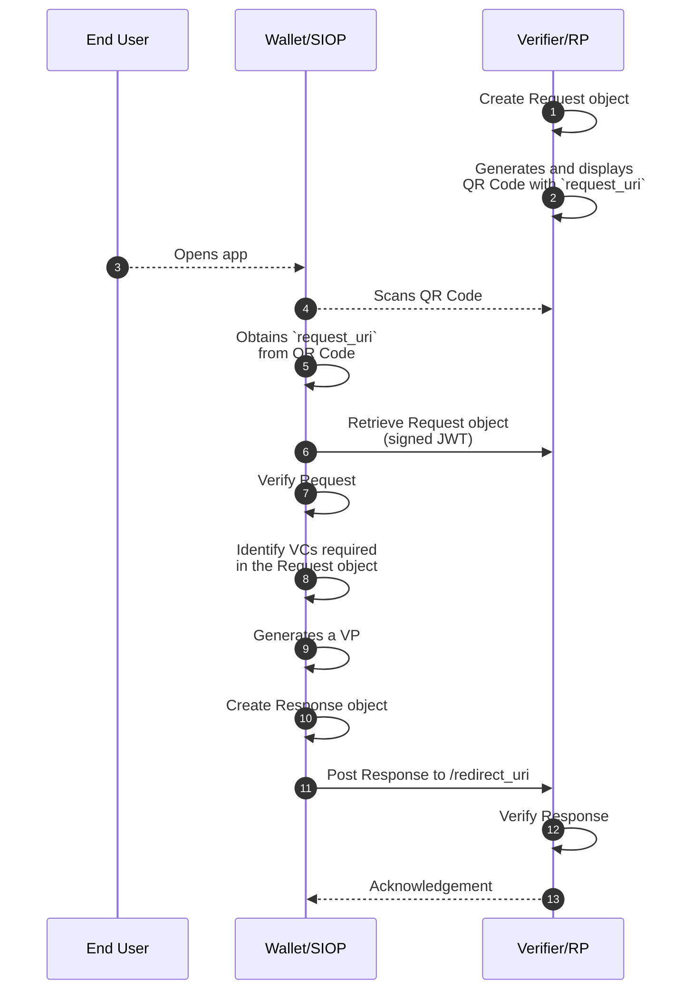
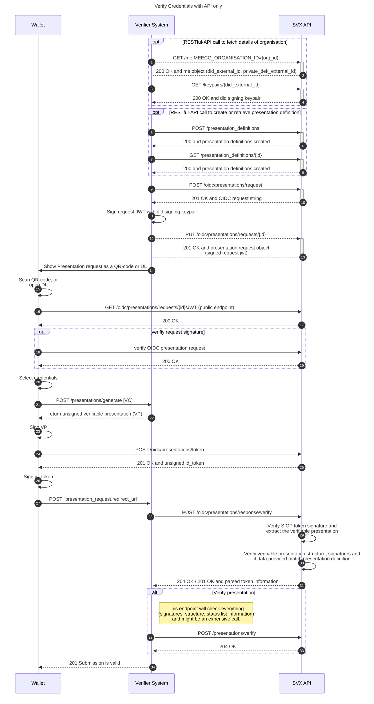

# OpenID Connect for Verifiable Presentations

Below is a list of endpoints that assist a Holder wallet and a Verifier to participate in the [OpenID for Verifiable Presentations](https://openid.net/specs/openid-4-verifiable-presentations-1_0.html) protocol. Built on top of OAuth 2.0, it allows a client (wallet) to present claims in the form of [W3C Verifiable Credentials](https://www.w3.org/TR/vc-data-model/). Currently, credentials and presentations in JWT format (vc-jwt, vp-jwt) are supported.

The endpoints provided are to support the following high-level verification flow:



The flow centres around the creation and exchange of a Request and a Response object, by the Verifier and Holder (wallet) respectively. The endpoints are categorised under these two headings.

## Prerequisites

- [DID](../dids/did-methods.md)
- [Presentation](../credentials/presentations.md)

## Who can undertake this operation?

Organisations (Verifiers) and users (Holders) in a verification flow using the OpenID Connect protocol.

## Request

List of endpoints to help create and verify the [Request](https://openid.net/specs/openid-4-verifiable-presentations-1_0.html#name-request) part of the verification flow.

### Create Presentation Requests

Creation of a presentation request.

**Endpoint**

```bash
POST /oidc/presentations/requests
```

**Request**

* Organisation (header, optional)
* Name – Title string
* Description – Explains the purpose for which the request is created
* Verifier
  * [DID](../dids/did-methods.md)
  * Name
* Expiration Date – Timestamp the request token expires
* Redirect Base URI
* [Presentation Definition](../credentials/presentation-definitions.md)

**Response**

The presentation request object that includes an unsigned JWT. The client calling this endpoint (e.g. verifier system) is responsible for adding the signature.

### Update Presentation Request

Update an existing presentation request by ID.

One of the options is to use the platform to host the (signed) request (see [here](#read-presentation-request-jwt)). The request parameters can't be updated, only the signed request JWT.

**Endpoint**

```bash
PUT /oidc/presentations/requests/{id}
```

**Request**

* Request ID
* Organisation (header, optional)
* Signed request JWT

**Response**

The updated presentation request object.

### Read Presentation Request JWT

A public endpoint that returns the (signed) presentation request JWT.

**Endpoint**

```bash
GET /oidc/presentations/requests/{id}/jwt
```

**Request**

* Request ID

**Response**

Signed presentation request JWT token.

### Verify Presentation Request

Verification of the SIOP token. The steps performed during this verification are:

1. Resolve Verifier DID
2. Verify request signature
3. Extract the presentation definition URI
   - Verify presentation definition structure

**Endpoint**

```bash
POST /oidc/presentations/requests/verify
```

**Request**

* Signed presentation request JWT

**Responses**

The result of the verification, either true or false.

## Response

List of endpoints to help create and verify the [Response](https://openid.net/specs/openid-4-verifiable-presentations-1_0.html#name-response) part of the verification flow.

### Create Presentation Response

Generate id_token for request submission based on the wallet information and the verifiable presentation token.

**Endpoint**

```bash
POST /oidc/presentations/token
```

**Request**

* Presentation Request JWT

**Response**

The presentation response object that includes two unsigned JWTs, `id_token` and `vp_token`. The client calling this endpoint (e.g. Holder wallet) is responsible for adding the signatures for each token.

### Verify Presentation Response

Verify the presentation response to a given request. The steps performed are:
1. Verify ID Token
2. Verify VP Token
   - [Verify presentation](../credentials/presentations.md)
3. Verify if the response is valid for the given request, i.e. if it matches the presentation definition from the request

**Endpoint**

```bash
POST /oidc/presentations/response/verify
```

**Request**

* Presentation Request JWT
* Signed ID Token
* Signed VP Token

**Response**

The result of the verification, either true or false. In case of false, all errors are provided, with an explanation.

## Detailed Sequence Diagram of the Flow (API integration)


