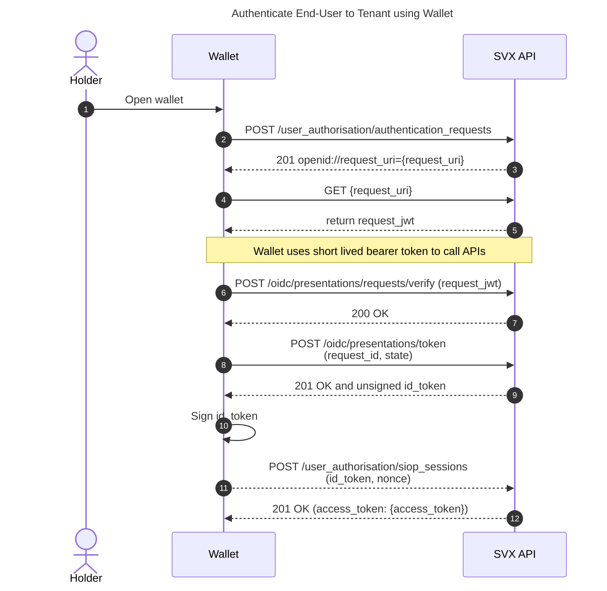

# Authenticating End-Users to a Tenant

The sequence diagram below shows the process of how a user controlling a DID, that is registered with a tenant, can authenticate to our system using a [digital wallet](/concepts/digital-wallets.md). This results in an access token that can be used to communicate with the SVX API.

This process is also referred to as DID authentication using SIOP V2.

