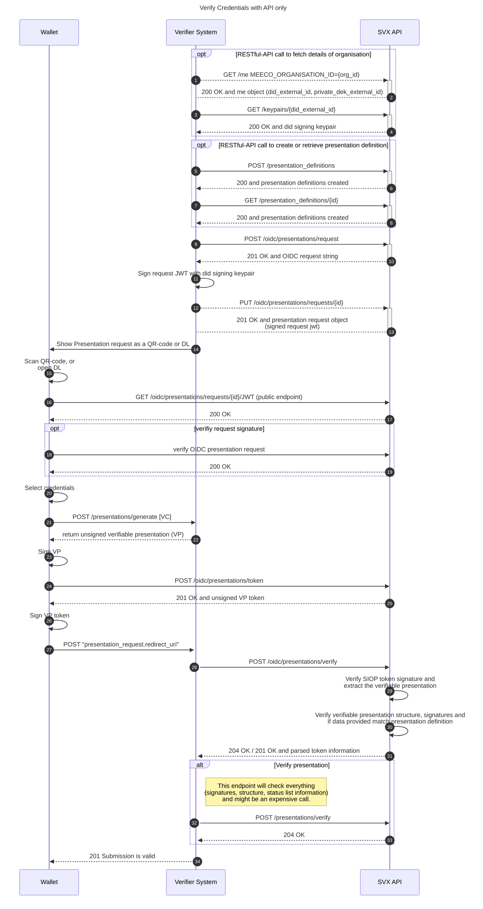

# Verifier - Holder Presentation Flow (OIDC4VP)

The sequence diagram below shows the process of how a verifier creates a verification request, sends it to a wallet holder, which subsequently verifies the request and submits a response.

