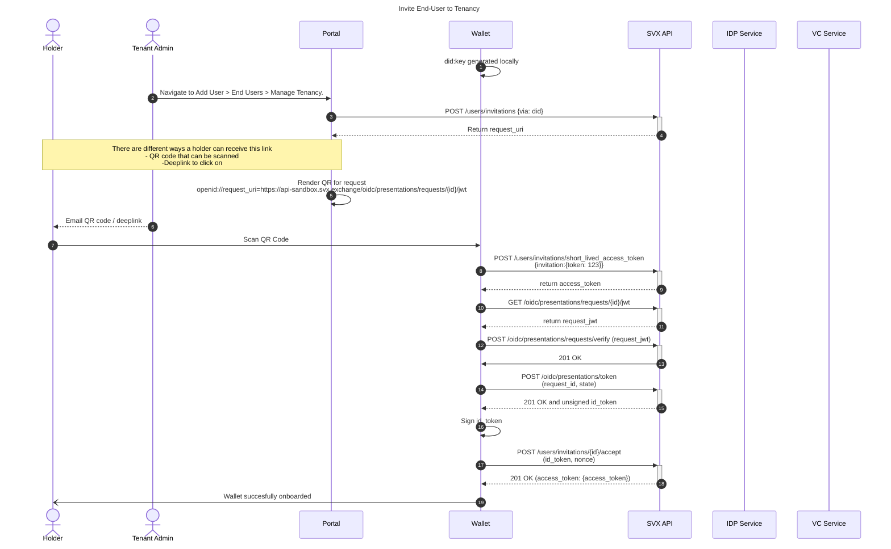

# Inviting End-Users to a Tenant

The sequence diagram below shows the process of how a person is invited and then added to our system by a tenant administrator.

```mermaid
sequenceDiagram
  title Invite End-User to Tenancy

  autonumber

  actor H as Holder
  actor TA as Tenant Admin

  participant P as Portal
  participant W as Wallet
  participant API as SVX API
  participant IDP as IDP Service
  participant VC as VC Service

  W->>W: did:key generated locally
  TA->>P: Navigate to Add User > End Users > Manage Tenancy.
  P->>+API: POST /users/invitations {via: did}
  API-->>-P: Return request_uri
  Note over H,P: There are different ways a holder can receive this link<br>- QR code that can be scanned<br>-Deeplink to click on
  P->>P: Render QR for request <br> openid://request_uri=https://api-sandbox.svx.exchange/oidc/presentations/requests/{id}/jwt

  TA-->>H: Email QR code / deeplink

  H->>W: Scan QR Code
  W->>+API: POST /users/invitations/short_lived_access_token<br/>{invitation:{token: 123}}
  API-->>-W: return access_token
  W->>+API: GET /oidc/presentations/requests/{id}/jwt
  API-->>-W: return request_jwt
  W->>+API: POST /oidc/presentations/requests/verify (request_jwt)
  API->>-W: 201 OK
  W->>+API: POST /oidc/presentations/token<br>(request_id, state)
  API-->>-W: 201 OK and unsigned id_token
  W->>W: Sign id_token

  W->>+API: POST /users/invitations/{id}/accept <br>(id_token, nonce)
  API-->>-W: 201 OK (access_token: {access_token})

  W-)H: Wallet succesfully onboarded
```