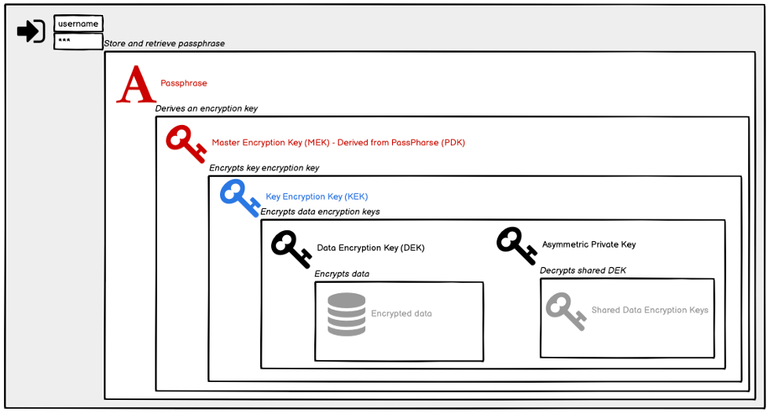

## Introduction

* What are keys?

* Why are (encryption) keys important in this industry?

Meeco’s encryption key management service enables users to generate, manage and deploy keys to encrypt and protect data at rest, in transit and when exchanged. Our data and key architecture is designed for non-correlation, with all attributes encrypted with a Universally Unique Identifier (UUID). Provisioning UUIDs provides the foundation for Web3 applications where business rules and value drivers can be aligned to single identifiers.

## Overview ##

With a strong focus on privacy and security around the management and exchange of data, Meeco understands the importance of data encryption. With this in mind, we provide a key management service called the Keystore that enables users to easily access their data whilst ensuring it remains secure and protected. To do this we employ multiple cryptographic key types, all of which serve a purpose:

Master Encryption Key (MEK): a derived key (created from a passphrase) that encrypts the KEK. It is held by each endpoint (user), and it is never shared.

Key Encryption Key (KEK): encrypts all other keys.

Keypair: controls a DID.

Data Encryption Key (DEK): used to encrypt data that goes into the Vault (i.e. Items).There are two types of DEKs:​

DEK for personal data is used to encrypt and decrypt data exchanged with the Vault.​

DEK for sharing data is used to encrypt and decrypt data exchanged with another user.

These keys can be setup, stored and accessed via our Keystore service. The Keystore enables users to store and retrieve their DEKs and Keypairs. An advantage of using the Keystore is that users can use the same keys to securely log into systems they are authorised to do so from different devices. Before a user sends their keys to the Keystore for safe keeping, they are encrypted to ensure only the user can read them.

When organising and managing a user’s keys, a key hierarchy is employed. Key hierarchy is a tiered approach to gaining access to encrypted data. Without the next key in the hierarchy, accessing encrypted data is not possible. For example, when data is securely stored, first a DEK and a Keypair are required. To encrypt the keys (DEK and the Private Key of the Keypair), a new symmetric key is generated, this is referred to as the KEK.

To secure the stored KEK, it is encrypted by a symmetric key, the MEK, that is derived by a Password-Based Key Derivation Function (PBKDF2), which requires an input from the user. This is referred to as the PDK (Passphrase/Password Derived Key).

Meeco does not store a user’s passphrase directly, we do however offer a Passphrase Store service that allows users to store and retrieve their passphrase. Access to the service requires a username and password (user specified). The passphrase is generated by the service to ensure a strong passphrase is used for the derivation function.

We use the term “passphrase” to distinguish it from a password that can be reset.

 
