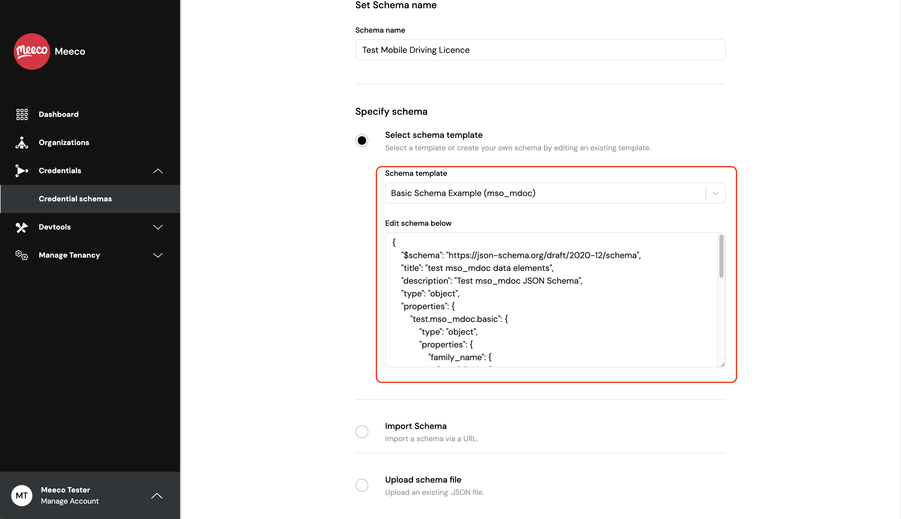
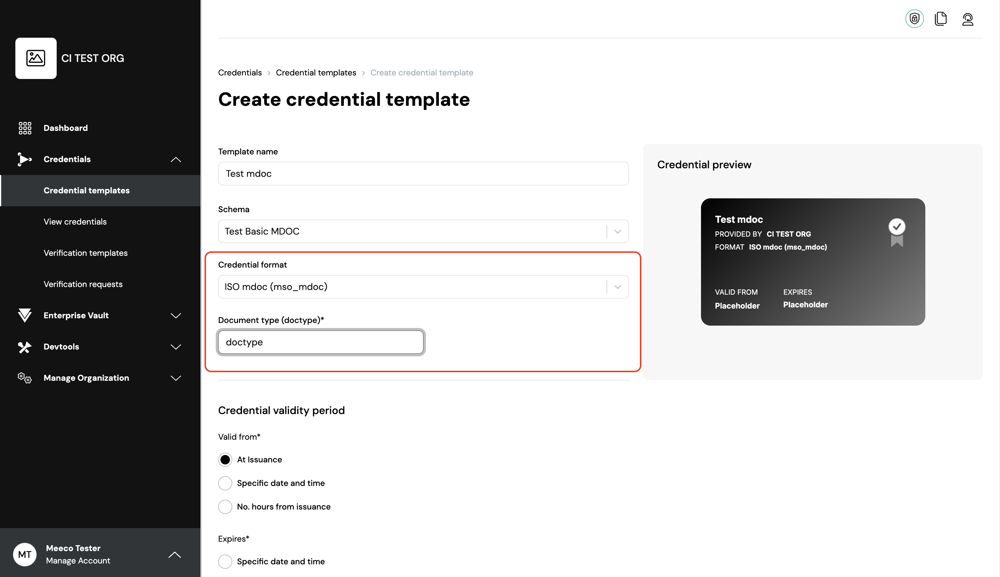
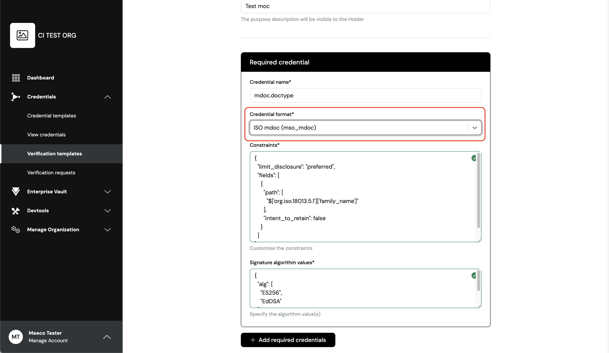
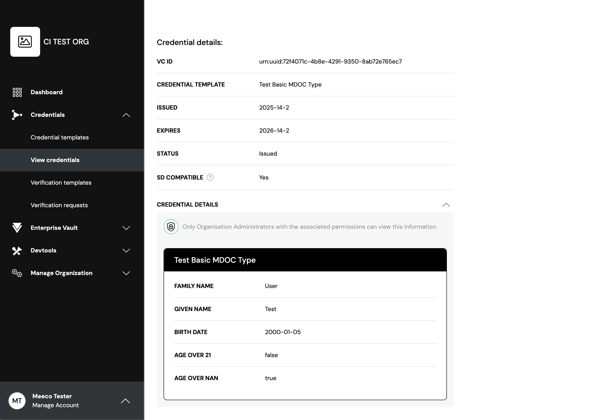
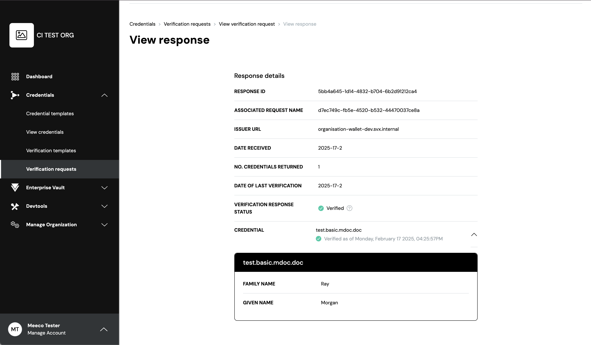

# SVX 2.1.0 Release Notes

**Software Release Date:** 06 March 2025

**Summary:** 

In this release, we continue to advance our vision of supporting production-ready credential formats. In addition to IETF SD-JWT VC and W3C Verifiable Credentials (as JWT), SVX now supports the ISO Mobile Document format (mdoc) – defined in ISO/IEC 18013-5 Mobile Driving License. In addition to adding mdoc capabilities, we have also made usability enhancements across SVX as well as implemented bug fixes and security updates. Items covered in this release are outlined below:

- **ISO Mobile Documents (mdoc) support:** The SVX API, Organisation Wallet (OW) API and Holder Wallet (HW) API have been updated to support ISO Mobile Documents (with credential format identifier mso_mdoc) including issuance and verification using the OpenID4VCI and OpenID4VP protocols. The presentation of mdoc is compliant with ISO/IEC 18013-7. Additionally, the Portal now supports the creation of credential and verification templates for ISO Mobile Documents.

- **Support for JARM and JWE:** As part of supporting ISO/IEC 18013-7, we have introduced OpenID JARM (JWT Secured Authorization Response Mode for OAuth 2.0) and IETF JWE (JSON Web Encryption) to enhance authorization response security through signing and optional encryption. 

- **Other New Functionalities:** Users now have more options when creating credential templates in the Portal. They can set the validity period of the credential and configure the vct and disclosure frame for the SD-JWT VC format. Additionally, a new Language page has been added to the Portal, allowing users to set their default language.

- **Enhancements:** Usability improvements have been made in the Portal, such as credential templates now displaying human-readable format names and tenants becoming searchable by their tenant ID. Additionally, the OW and HW now include optional configuration variables for Swagger UI and test endpoints.

- **Bug fixes:** Issues relating to translation errors and credential schema editing have now been fixed in the Portal. In the OW UI, we have resolved issues with input fields.

- **Holder Wallet Frontend (HW-FE) Updates:** With the latest version (2.6.4), HW-FE has added support for mdoc format credentials and enhanced flexibility to accommodate the new protocol, `openid4vp-draft18`, for verifiable presentations.

# Support for ISO Mobile Documents
## What are Mobile Documents (mdocs)?
A Mobile Document (mdoc) is a digitally signed, standardised electronic document. It uses the CBOR formatting defined in [RFC 8949](https://datatracker.ietf.org/doc/html/rfc8949). CBOR uses binary encoding which features a small footprint (especially compared to JSON) and is, therefore, ideal for bandwidth constrained environments. Similar to other formats it can be used for both online and proximity use cases, although it is a better fit for the latter. These documents are designed to securely replace physical credentials including, but not limited to IDs, driving licences, passports, or medical records.

### Mobile Driver’s Licences (mDLs)
Mobile Driver’s Licences (mDLs) are a type of mdoc. SVX supports the issuance of mDL (and other document types) through OpenID 4 Verifiable Credential Issuance (OID4VCI).

SVX now supports [ISO/IEC TS 18013-7](https://www.iso.org/standard/82772.html) using OpenID 4 Verifiable presentation (OID4VP), which enables the presentation of mdocs to a reader (verifier) over the internet.

## New Functionalities and Changes
### SVX API
#### POST /schemas
Since JSON Schema types alone are not able to specify the correct encoding in CBOR, we extended JSON Schema definitions by introducing the `x-cbor-encoding` keyword for both validation and generating the correct CBOR encoding.

For example, if you want to define the field `portrait` in CBOR (bitstring), you would use the following 
````
"portrait": {
      "type": "string",
      "description": "jpeg as base64url encoded",
      "x-cbor-encoding": "bstr"
}
````

Below you can find how CBOR datatypes are mapped to JSON schema types:

|datatype|description|JSON schema|
|--------|-----------|-----------|
|bool|Boolean value (major type 7)|`{ “type”: “boolean” }`|
|uint|unsigned integer (major type 0)|`{ "type": "integer" }`|
|nint|negative integer (major type 1)|`{ "type": "integer" }`|
|int|unsigned integer or negative integer|`{ "type": "integer" }`  no way to specify; assumption is this is handled by cbor encoding library|
|float16|half-precision float (major type 7, add info 25)|`{ "type": "number", "x-cbor-encoding": "float16"  }`|
|float32|single-precision float (major type 7, add info 26)|`{ "type": "number", "x-cbor-encoding": "float32"  }`|
|float64|double-precision float (major type 7, add info 27)|`{ "type": "number", "x-cbor-encoding": "float64"  }`|
|float|one of float16, float32 or float64|`{ "type": "number" }`  assumption: handled by cbor library|
|bstr|byte string (major type 2)|`{ "type": "string", "x-cbor-encoding": "bstr" }`|
|tstr|text string (major type 3)|`{ "type": "string" }`|
|tdate|Standard date/time string (#6.0)|`{ “type”: “string”, “format”: “date-time” }`|
|bigint|biguint (#6.2) or bignint (#6.3) (bstr)|`{ "type": "string", "x-cbor-encoding": "bigint" }`|
|regexp|tstr #6.35|`{ “type”: “string”, "format": "regex" }`|
|full-date|full-date string (#6.1004)|`{ "type": "string", "format": "date"}`|
|encoded-cbor|#6.24 (bstr)|`{ "type": "string", "x-cbor-encoding": "encoded-cbor" }`|

#### POST /credential_types
- Extended format with `mso_mdoc`.
- Added `config.doctype` (required when format equals mso_mdoc).

#### POST /credentials/generate
The following additional parameters are now available to use in the request payload:
- `doctype` : The docType of the Mobile Document (mdoc)
- `device_key_info`

#### POST /presentations/verify and /openid/presentations/response/verify
- Added verification for base64url encoded `mso_mdoc`.

#### POST /presentation_definitions
- Added support for requesting `mso_mdoc`.
Note that the `id` from the `input_descriptor` object needs to match the doctype of an mdoc. This requirement is defined in ISO/IEC 18013-7 and implemented as such for all mobile documents in SVX. 

### Organisation Wallet (OW) API and Holder Wallet (HW) API
- Added support for `mso_mdoc` issuance and verification in OCW and HCW API.

### Portal
#### Create Credential Schema
- The `Basic Mdoc JSON Schema` template for `mso-mdoc` format is available for use when creating a credential schema. 
<p align="center">

</p>  

#### Create Credential Template
- Users can select `ISO mdoc (mso_mdoc)` and add the document type as free text.
<p align="center">

</p>  

#### Create Verification Template
- Added `ISO mdoc (mso_mdoc)` format to `Create Verification Template` along with its constraints.
<p align="center">

</p>  

#### View Credentials and Verification Requests
- Issued credentials and verification requests that contain mdocs can be viewed via the Portal in the same way as other credential format types.
<p align="center">

</p>  
<p align="center">

</p>  


# Support for JARM and JWE
Included in the ISO/IEC 18013-7 implementation, support has been added to the SVX API, HW API and OW API for:
* [OpenID JARM](https://openid.net/specs/oauth-v2-jarm.html): JWT Secured Authorization Response Mode for OAuth 2.0
* [IETF JWE](https://www.rfc-editor.org/rfc/rfc7516.html#appendix-A): JSON Web Encryption
This section provides a brief overview of both and lists the changes made to the platform in order to support it.

## JARM
JARM is a JWT-based mode to encode OAuth 2.0 authorisation responses.
As stated in the [OpenID JARM](https://openid.net/specs/oauth-v2-jarm.html) standard:
> This mechanism enhances the security of the standard authorization response with support for signing and optional encryption of the response. A signed response provides message integrity, sender authentication, audience restriction, and protection from mix-up attacks. Encrypting the response provides confidentiality of the response parameter values. The JWT authorization response mode can be used in conjunction with any response type.

We have extended the HW and OW with support for encryption and optional signing of the response. The advantage of an encrypted, but not signed authorization response, is that it prevents the signing key from being used as a correlation factor. From a privacy perspective this is important. Establishing trust in the signing key can be challenging when ensuring authenticity. 

[OpenID4VP](https://openid.net/specs/openid-4-verifiable-presentations-1_0.html#section-8.3.1) specifies a new response mode, direct_post.jwt which allows the use of JARM with the direct_post response mode. The response mode direct_post.jwt, similar to direct_post, causes the Wallet to send the authorization response using an HTTP POST request instead of redirecting back to the Verifier. Different from direct_post, direct_post.jwt encapsulates the response parameters in a JWT that is encrypted and optionally signed.

Encrypting the authorization response can prevent personal data in the authorization response from leaking when it is returned through the front channel (e.g. the browser).

JARM is mandatory when following ISO/IEC 18013-7, but can also be used in other scenarios and with other credential formats.

## JWE
JWE is an encrypted JSON Web Token (JWT).
As stated in the [IETF JWE](https://www.rfc-editor.org/rfc/rfc7516.html#appendix-A) standard:
> JSON Web Encryption (JWE) represents encrypted content using JSON data structures and base64url encoding. The JWE cryptographic mechanisms encrypt and provide integrity protection for an arbitrary sequence of octets.

JWE is used when encrypted authorization responses are enabled (using JARM).

## New Functionalities and Changes
### SVX API
#### POST /openid/presentations/requests
- Added support for `direct_post.jwt` in the `response_mode` field.
#### POST /credentials/generate 
- Added with `credential.id` and `credential.credential_id` attributes in the response.

### OW API
- Added support for `direct_post.jwt` to comply with `JARM`.
  - Added `responseMode` to `POST - /presentations/requests` request body and response
  - Added `responseMode` dropdown to `test/present` template site
- Added new required configuration variables:
  - `PRESENTATION_RESPONSE_ENCRYPTION_ENC` - defines `direct_post.jwt` method.
  - `PRESENTATION_RESPONSE_ENCRYPTION_ALG` - defines `direct_post.jwt` algorithm.
  - `PRESENTATION_RESPONSE_ENCRYPTION_CURVE` - defines `direct_post.jwt` curve.
- Added support to accept encrypted authorization response for `POST /openid/presentations/requests/:requestId/submissions` endpoint.

### HW API
- Added validation of `direct_post.jwt` to `POST /wallets/{walletId}/send`.

# Other New Functionalities
## Portal
### Create Credential Template
- Added Type (vct) field for `vc+sd-jwt` format when creating, editing and viewing a credential template in the `Credential templates` section.
<p align="center">

</p>  

- Added `Disclosure Frame` field on `Create credential template` page for `vc+sd-jwt` format.
<p align="center">

</p>  

- It is now possible for users to set and edit a credential’s validity period in the `Create credential template` page.
<p align="center">

</p>  

### View Credential Template
- After creating a credential template, users can now view the valid from and expires information based on the configuration set when creating the credential template.
<p align="center">

</p>  

### Manage Account
- Added `Language` section to `Manage Account` page to allow a user to change their default language. This feature currently supports English and Japanese.
<p align="center">

</p>  


# Enhancements
## Portal
### Changed
- Tenants can be searched for by their IDs or fragments of their IDs.
<p align="center">

</p>  

- Changed all instances of credential `format` to a human readable name when viewing on the `Credential templates` page. If the format is `mso_mdoc` then the document type is also displayed.
<p align="center">

</p>  

- Changed the order of fields on `Create verification template` screen so that the format selection field is above the fields it affects. This improves usability and information hierarchy.
<p align="center">

</p>  

- When viewing a verification response, shared credentials that do not contain any data no longer display an empty box on the `View Response` screen. Instead, a warning message appears stating "No credential details provided".
<p align="center">

</p>  

- Migrated the application from Webpack to Vite for improved performance.

## SVX API
### Changed
- Improved the reliability of event processing by using a new AMQP architecture with a background AMQP consumer in Ruby (on Rails) components. Connections to RabbitMQ are now more stable for Vault and Keystore.

## OW API
### Added
- Added enforcement of `kid` presence in `ACCESS_TOKEN_JKWS`, `AUTHORIZATION_SERVER_JWKS`, and `ISSUER_JWKS `configurations.
- Added validation of `access_token` against cNonce for security, preventing brute force attacks on the `cNonce`.
- Added optional configuration variable `SWAGGER_UI_ENABLED` to enable/disable Swagger UI (accessible at `/openapi/ui`). By default, Swagger UI is enabled, but it can be disabled by setting `SWAGGER_UI_ENABLED='false'`.
- Added `TEST_ENDPOINTS_ENABLED` configuration variable to enable/disable `test/*` set of endpoint. When turned off, the Test UI is no longer accessible, but issuance and presentation flows keep working.

### Removed
- `upgradeInsecureRequests` CSP directive from Content-Security-Policy response header as it was forcing the browser to upgrade all requests to HTTPS.

## HW API
### Added
- Added optional configuration variable `SWAGGER_UI_ENABLED` to enable/disable Swagger UI (accessible at `/openapi/ui`). By default, Swagger UI is enabled, but it can be disabled by setting `SWAGGER_UI_ENABLED='false'`.

### Removed
- `upgradeInsecureRequests` CSP directive from Content-Security-Policy response header as it was forcing the browser to upgrade all requests to HTTPS.
- Removed the `format` property from the `POST /wallets/{walletId}/receive/get_credential` payload.

### Changed
- The `client_id` parameter is now required for wallet-initiated issuance and Authorization Code Grant when calling the `POST /wallets/:walletId/receive/get_access_token` endpoint.
- `vc+sd-jwt` credential claims are no longer by default disclosed if `claims_to_disclose` parameter was not provided when presenting.

# Bug Fixes
## Portal
- Fixed translation of version numbers in `Footer` that resulted in no version number being displayed.
- Fixed Tenant ID label in Tenants list and the administered Tenants from `Tenant DID` to `Tenant ID`.
- Fixed the schema name to be editable on the `Credential Schema` page.

## OW API
- Fixed an issue where existing values were not being set correctly for text area elements on `test/issue` page.

# Security Updates
## SVX API  
- Node in VC upgraded to version 20.18
- OpenAPI generator in VC upgraded to version 7.10.0
- @nestjs/swagger in VC upgraded to 8.1.1
- SDK Typescript version to ^5.0.0 and Node version to ^20.0.0 in VC 
- Ruby upgraded to 3.3.6
- Elixir upgraded tp 1.18.2
- Erlang upgraded from version 26.2.5.7

## OW API
- Node in VC upgraded to version 20.18
- OpenAPI generator in VC upgraded to version 7.10.0
- SDK Typescript version to ^5.0.0 and Node version to ^20.0.0

## HW API
- Node in VC upgraded to version 20.18

# Holder Wallet Frontend (HW-FE) Updates
- Current latest version: 2.6.4
- Added ability to receive and present credentials with mdoc format
- Added ability to support credential issuance auth flow
- Added `openid4vp-draft18` in the Request Protocol Version to enable selection in the wallet configuration
<p align="center">

</p>   

- Fixed display "That barcode appears to be invalid" error when logged in with Auth0

# Deprecations and EOL
None