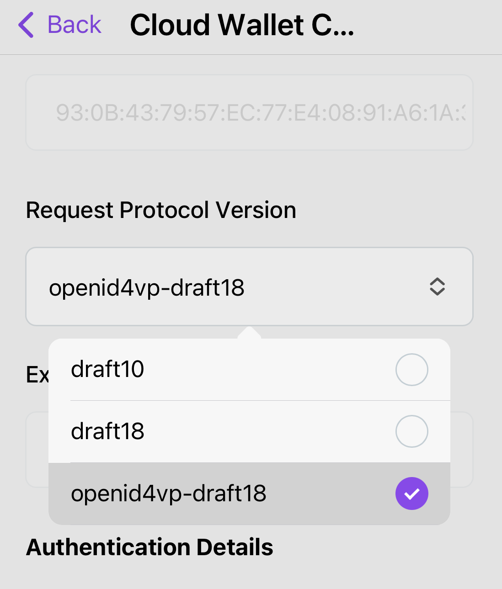

# SVX 2.1.0 Release Notes

**Software Release Date:** 06 March 2025

**Summary:** 

In this release, we continue to advance our vision of supporting production-ready credential formats. In addition to IETF SD-JWT VC and W3C Verifiable Credentials (as JWT), SVX now supports the ISO Mobile Document format (mdoc) – defined in ISO/IEC 18013-5 Mobile Driving License. In addition to adding mdoc capabilities, we have also made usability enhancements across SVX as well as implemented bug fixes and security updates.  
Items covered in this release are outlined below:

**Release of Organisation Wallet and Holder Wallet**  

SVX has evolved to include two new components: Organisation Wallet and Holder Wallet services. Managing the functionalities associated with Issuers, Verifiers and Wallet Providers via separate APIs helps our customers streamline credential issuance, management, and presentation workflows. Built on open standards, these APIs currently support two of the leading credential formats: W3C Verifiable Credentials (JWT) and IETF SD-JWT VCs. 

These new components enhance efficiency, ensure security, and enable seamless integration with global credential ecosystems, empowering users to adopt advanced digital identity solutions with confidence and trust.

**Revised Digital Credentials APIs**

This release features a complete revision of all APIs related to digital credential management, aligning them with the latest changes in global standards in the same domain. These changes include support for: 

- OpenID for Verifiable Credential Issuance (OpenID4VCI) draft 13 (ID-1) 
- OpenID for Verifiable Presentations (OpenID4VP) protocols draft 18 (ID-2)
- W3C Bitstring Status List

Based on our experience gained and the feedback we have gathered in the past couple of years, we have implemented the following revisions in our APIs:

- The consistent application of credential schemas across various credential formats.
- The enablement of credential types to be format-specific to provide greater control over format-specific configuration.
- The management of how presentation requests and responses are handled.
- Consistent issuer and holder key binding for JWT based credential formats.

The APIs have been refactored for consistency and efficiency, including route updates (e.g., replacing `/oidc/` with `/openid/`) and payload restructuring to simplify integration. The HCW API now handles multi-credential submissions more effectively, and the OCW API introduces configurable protocol versions for issuance and presentation workflows.

These improvements streamline credential issuance, presentation, and verification processes while ensuring robust security and adherence to global standards. By embracing cutting-edge specifications and modern credential formats, the SVX platform positions itself as a leader in scalable, interoperable, and future-ready digital identity solutions.

## Organisation and Holder Wallet
As digital identity management, age verification, and other verification-driven use cases continue to grow, organisations - including identity providers and businesses relying on personal data - along with end-users, need a secure and trusted solution for efficient credential management. SVX is excited to introduce our Organisation Wallet and Holder Wallet services, designed to simplify and enhance these complex interactions. They are built on top of the existing SVX API and Portal and leverage credential and secure storage capabilities.

<p align="center">

</p>

Both components offer the necessary tools for customers looking to participate in the Issuer-Holder-Verifier model using digital credentials as a mechanism to exchange Issuer asserted claims about the Holder.

<p align="center">

</p>

### Organisation Wallet Services
Composed of the following tools to bootstrap issuance and verification of credentials:

- Organisation Cloud Wallet (OCW) service for streamlining issuance and verification of credentials for organisations.
- Issuer / Verifier websites integrated with OCW for jumpstarting use cases.

### Holder Cloud Wallet Services
Composed of the following tools:

- Holder Cloud Wallet (HCW) service for streamlining key management, DID management, and the issuance and presentation of credentials.
- White-label Holder Wallet Front End; a multi-platform mobile app, integrated with the HCW service.
- Out-of-the box integration with OAuth 2.0 & OpenID Connect compatible IdPs for user authentication.

### Benefits of Organisation and Holder Cloud Wallet Services
**1. Comprehensive Credential Management:**
- Organisation Wallet: Enables seamless issuance, storage, and presentation of digital credentials for efficient identity operations.
- Holder Wallet: Allows end-users to receive, claim, and present Verifiable Credentials with ease.

**2. Interoperability Across Ecosystems:**
- Both wallets are built on widely accepted standards, including but not limited to OpenID for Verifiable Credential Issuance (OpenID4VCI), OpenID for Verifiable Presentations (OpenID4VP) and IETF SD-JWT VC.
- They enable interoperability across various credential ecosystems unlocking valuable use cases.

**3. Enhanced Security and Trust:**
- Organisation Wallet: Protects sensitive identity data and ensures the authenticity and integrity of issued credentials.
- Holder Wallet: Safeguards individual user data while ensuring the validity of presented credentials.

**4. Scalable Integration:**
- Both services offer APIs that enable organisations, companies, and individuals to integrate seamlessly into existing credential ecosystems, ensuring broad scalability and ease of adoption.

**5. Support for Various Credential Formats:**

The APIs enable the issuance, presentation, and verification of multiple credential formats, including:
- W3C Verifiable Credential Data Model (VCDM) JWT
- IETF SD-JWT VC

**6. Future-Ready Digital Identity Solutions:**
- Both wallets provide a strong foundation for adopting advanced technologies like Verifiable Credentials and decentralised identity frameworks, supporting a wide range of use cases and future innovations.

**7. Streamlined Data and Workflow Management:**
- Organisation Wallet: Simplifies the administration of credential types and linked records, reducing complexity.
- Holder Wallet: Offers a user-friendly mechanism for managing credentials, ensuring smooth workflows for end-users.

**8. Backend Services Designed for Efficiency, Privacy, and Security:**
- Both the Organisation and Holder Wallets are backend services, purposefully designed to prioritise efficiency, privacy, and security in managing credentials.
- The APIs empower SVX customers to develop customised, robust front-end solutions while leveraging global frameworks to ensure seamless interoperability across ecosystems.
- Both services integrate with existing OpenID & OAuth 2.0 compatible IDPs for identity and access management.

## Revised Digital Credentials APIs
To recap, the revision of our Digital Credentials API has led to the following outcomes:
- The consistent application of credential schemas across various credential formats.
- The enablement of credential types to be format-specific to provide greater control over format-specific configuration.
- The management of how presentation requests and responses are handled.
- Consistent issuer and holder key binding for JWT based credential formats.

### Improved Credential and Verification Templates
- When creating Credential Templates, Organisation Administrators can now choose from either `jwt_vc_json` or `vc+sd-jwt` credential formats. This results in format-specific templates that allow customisation of format specific features. For example, when creating a `vc+sd-jwt` credential template, it is now possible to specify disclosure frames associated with selectively disclosable credentials.
- Organisation Administrators have more control when creating verification templates. They can add multiple verifiable credentials of both types (`jwt_vc_json` and `vc+sd-jwt`) to a single verification request and can define the associated options as specified in DIF Presentation Exchange per required credential. See video below for reference.

<p align="center">

</p>

- **Credential and Verification Templates:**
  - Added the option to select either `jwt_vc_json` or `vc+sd-jwt` credential format when creating a credential template to increase specificity and to enable more use cases.
  - Added a field for specifying disclosure frames when creating `vc+sd-jwt` credential templates to increase control over `vc+sd-jwt` credential issuance.
  - Added a Format column to the credential templates view screen for improved organisation.
  - Added new `credential name` and `format` fields (per required credential) when creating verification templates for enhanced customisation and usability.
  - Made `format algorithm` and `Constraints` _required_ fields when creating verification templates to extend customisation over each required credential.

- **Request Responses:**
  - Added the date a request response was archived (when viewing its details) to enable more accurate record keeping. The associated attribute is `archived on`.

## Consistent Key Binding for Issuer and Holder
- It is now possible to reference a cryptographic key or DID controlled by the Holder with all JWT based formats in a consistent manner. This is done by using the `cnf` claim, introduced in [Proof-of-Possession Key Semantics for JSON Web Tokens (RFC7800)](https://datatracker.ietf.org/doc/html/rfc7800).

Below is an example of an unprotected payload of a JSON Web Token demonstrating how key binding works when using the JWK member to reference the public key part of an asymmetric keypair.

```
{
  "cnf": { 
    "jwk": {
      "kty": "EC",
      "x": "tr_F2pPBVmlpysrvPRojMIrI06DiuhXBz8B9idb8R6s",
      "y": "2MlG9HNZfFZFB6Tv7lUB6KZLaBh2YF77yU8WzPswmqc",
      "crv": "P-256",
      "alg": "ES256"
    }
  }
}
```

Below is an example of an unprotected payload of a JSON Web Token demonstrating how key binding works when using the JWK member referencing a DID URL using the `kid` of the JWK member as well as including the public key of an asymmetric keypair controlling the DID.

```
{
  "cnf": { 
    "jwk": {
      "kid": "did:key:base64#key1-id",
      "kty": "EC",
      "x": "tr_F2pPBVmlpysrvPRojMIrI06DiuhXBz8B9idb8R6s",
      "y": "2MlG9HNZfFZFB6Tv7lUB6KZLaBh2YF77yU8WzPswmqc",
      "crv": "P-256",
      "alg": "ES256"
    }
  }
  "credentialSubject": {
    "id": undefined 
  }
}
```

Note that in the latter case the `id` property of the `credentialSubject` claim remains undefined to not cause clashes.
- Similarly to the point above, an Issuer can be both a HTTPS URL or a DID for all JWT based credential formats (`jwt_vc_json`, `vc+sd-jwt`). 

## Support for X.509 Certificate Chains
- Credentials and Presentation Requests can now be secured using X.509 Certificate Chains. These use the `x5c` header claim, which is a list of X.509 Certificates, that enables verification of the JWT's digital signature. This mechanism ensures the authenticity and integrity of the JWT, helping to prevent token abuse and foster trust between parties. While this component validates the correctness of the signature, it is at the discretion of the SVX consumer to configure and implement trust checks.

## Updated JSON Schema Support
- **Schema Update:** VC API now supports the latest version of the [VC JSON Schema specification](https://www.w3.org/TR/vc-json-schema/). The schema now describes the entire credential, not just credentialSubject as in earlier implementations. For W3C VCDM credentials, credentialSubject must now be explicitly included in the schema.
- **Backward Compatibility:** The verification process continues to support older formats based on the credentialSchema.type attribute. Supported types include:
  - JsonSchemaValidator2018 (current implementation)
  - JsonSchema2023, JsonSchema, and FullJsonSchemaValidator2021 (latest spec versions)
  - Unknown formats will result in errors
- **Schema Usage:**
  - Credential generation no longer includes `credentialSchema`, as it is rarely used in the VC ecosystem.
  - Schemas are used internally to validate if provided data matches the schema during credential generation.
  - Schemas may include reserved attributes (e.g., exp, issuanceDate), though it is recommended to focus on user claims. Reserved claims are respected and customisable if included.
- **Credential Formats:** Different credential formats may require distinct schemas.

This update ensures compliance with the latest specifications and maintains compatibility with legacy formats.

## Various
### UX enhancements
- Added copy buttons to the `Organisation ID` field in Organisation Account Settings, and `Application Domain` field when viewing Applications' details for improved user convenience.

<p align="center">

</p>

<p align="center">

</p>

- Corrected the spelling of `Documentations` to `Documentation` on Tenant and Organisation navigation menus.
- Changed Organisation navigation menu item name and associated screens from `Issue / Revoke Credentials` to `View credentials` as credential issuance functionality has been removed from the Portal (for more information see the [Deprecations and EOL](#deprecations-and-EOL) section).

<p align="center">

</p>

- Removed the `Issue Credential` action item as seen in the item dropdown menu via the `Credential Templates` page. This is due to credential issuance functionality being removed from the Portal (for more information see the [Deprecations and EOL](#deprecations-and-EOL) section).

<p align="center">

</p>

- The View Verification Request and View Response pages now display either `Wallet DID` or `Issuer URL` as a way to identify either the wallet or issuing organisation. This change was implemented due to `sd+vc-jwt`s not containing a `DID` resulting in an empty field in the Portal. 

### SDK Update
- Upgraded `meeco/sdk` to version `7.8.0-beta` for access to the latest features including those offered by the VC API V2 update.
- Updated `meeco/sdk` to include missing filter properties when creating a verification template. Previously, filter properties including `number` and `arrays` were not included resulting in verification templates to error.

## In summary
- **Bitstring Status List Support:** Enabled issuing and verifying revocable credentials using the new [W3C Bitstring Status List specification](https://www.w3.org/TR/vc-bitstring-status-list/). This is a new specification that enables the publishing of status information such as suspension or revocation of Verifiable Credentials using bitstrings in a privacy-preserving and performance-enhancing way.
- **Schema Improvements:** Added support for a newer version of [W3C JSON Schema](https://www.w3.org/TR/vc-json-schema/). Introduced greater schema definition flexibility so both credential formats: `jwt_vc_json` and `vc+sd-jwt` can be described independently.
- **Credential Types/Templates:** Format configuration introduced to the credential type entity. As credential formats have different requirements and configurations, keeping the credential type entity isolated makes its management easier.
- **Presentation Definitions/Templates:** API extended to support majority of [DIF PEX v2.1.0](https://identity.foundation/presentation-exchange/spec/v2.1.0/). Instead of providing only Credential Type IDs that are expected by the Presentation Definition, Organisation Administrators have to provide a full Presentation Definition structure with the required constraints.
- **New API Features:** Introduced endpoints and attributes for improved credential generation, presentation requests, and payload validation.
- **Streamlined Responses:** Simplified payloads and response structures for better clarity and alignment with updated standards.
- **Interoperability Updates:**
  - Adopted OpenID4VP [version draft18](https://openid.net/specs/openid-4-verifiable-presentations-1_0-18.html) (Implementors Draft 2).
  - Adopted OpenID4VCI [version draft13](https://openid.net/specs/openid-4-verifiable-credential-issuance-1_0-13.html) (Implementors Draft 1).
  - Integrated JSON Schema validation as per [DIF PEX v2.1.0](https://identity.foundation/presentation-exchange/spec/v2.1.0/).

# Other New Functionalities
## Portal
### Create Credential Template
- Added Type (vct) field for `vc+sd-jwt` format when creating, editing and viewing a credential template in the `Credential templates` section.
<p align="center">

</p>  

- Added `Disclosure Frame` field on `Create credential template` page for `vc+sd-jwt` format.
<p align="center">

</p>  

- It is now possible for users to set and edit a credential’s validity period in the `Create credential template` page.
<p align="center">

</p>  

### View Credential Template
- After creating a credential template, users can now view the valid from and expires information based on the configuration set when creating the credential template.
<p align="center">

</p>  

### Manage Account
- Added `Language` section to `Manage Account` page to allow a user to change their default language. This feature currently supports English and Japanese.
<p align="center">

</p>  


# Enhancements
## Portal
### Changed
- Tenants can be searched for by their IDs or fragments of their IDs.
<p align="center">

</p>  

- Changed all instances of credential `format` to a human readable name when viewing on the `Credential templates` page. If the format is `mso_mdoc` then the document type is also displayed.
<p align="center">

</p>  

- Changed the order of fields on `Create verification template` screen so that the format selection field is above the fields it affects. This improves usability and information hierarchy.
<p align="center">

</p>  

- When viewing a verification response, shared credentials that do not contain any data no longer display an empty box on the `View Response` screen. Instead, a warning message appears stating "No credential details provided".
<p align="center">

</p>  

- Migrated the application from Webpack to Vite for improved performance.

## SVX API
### Changed
- Improved the reliability of event processing by using a new AMQP architecture with a background AMQP consumer in Ruby (on Rails) components. Connections to RabbitMQ are now more stable for Vault and Keystore.

## OW API
### Added
- Added enforcement of `kid` presence in `ACCESS_TOKEN_JKWS`, `AUTHORIZATION_SERVER_JWKS`, and `ISSUER_JWKS `configurations.
- Added validation of `access_token` against cNonce for security, preventing brute force attacks on the `cNonce`.
- Added optional configuration variable `SWAGGER_UI_ENABLED` to enable/disable Swagger UI (accessible at `/openapi/ui`). By default, Swagger UI is enabled, but it can be disabled by setting `SWAGGER_UI_ENABLED='false'`.
- Added `TEST_ENDPOINTS_ENABLED` configuration variable to enable/disable `test/*` set of endpoint. When turned off, the Test UI is no longer accessible, but issuance and presentation flows keep working.

### Removed
- `upgradeInsecureRequests` CSP directive from Content-Security-Policy response header as it was forcing the browser to upgrade all requests to HTTPS.

## HW API
### Added
- Added optional configuration variable `SWAGGER_UI_ENABLED` to enable/disable Swagger UI (accessible at `/openapi/ui`). By default, Swagger UI is enabled, but it can be disabled by setting `SWAGGER_UI_ENABLED='false'`.

### Removed
- `upgradeInsecureRequests` CSP directive from Content-Security-Policy response header as it was forcing the browser to upgrade all requests to HTTPS.
- Removed the `format` property from the `POST /wallets/{walletId}/receive/get_credential` payload.

### Changed
- The `client_id` parameter is now required for wallet-initiated issuance and Authorization Code Grant when calling the `POST /wallets/:walletId/receive/get_access_token` endpoint.
- `vc+sd-jwt` credential claims are no longer by default disclosed if `claims_to_disclose` parameter was not provided when presenting.

# Bug Fixes
## Portal
- Fixed translation of version numbers in `Footer` that resulted in no version number being displayed.
- Fixed Tenant ID label in Tenants list and the administered Tenants from `Tenant DID` to `Tenant ID`.
- Fixed the schema name to be editable on the `Credential Schema` page.

## OW API
- Fixed an issue where existing values were not being set correctly for text area elements on `test/issue` page.

# Security Updates
## SVX API  
- Node in VC upgraded to version 20.18
- OpenAPI generator in VC upgraded to version 7.10.0
- @nestjs/swagger in VC upgraded to 8.1.1
- SDK Typescript version to ^5.0.0 and Node version to ^20.0.0 in VC 
- Ruby upgraded to 3.3.6
- Elixir upgraded tp 1.18.2
- Erlang upgraded from version 26.2.5.7

## OW API
- Node in VC upgraded to version 20.18
- OpenAPI generator in VC upgraded to version 7.10.0
- SDK Typescript version to ^5.0.0 and Node version to ^20.0.0

## HW API
- Node in VC upgraded to version 20.18

# Holder Wallet Frontend (HW-FE) Updates
- Current latest version: 2.6.4
- Added ability to receive and present credentials with mdoc format
- Added ability to support credential issuance auth flow
- Added `openid4vp-draft18` in the Request Protocol Version to enable selection in the wallet configuration
<p align="center">

</p>   

- Fixed display "That barcode appears to be invalid" error when logged in with Auth0

# Deprecations and EOL
None