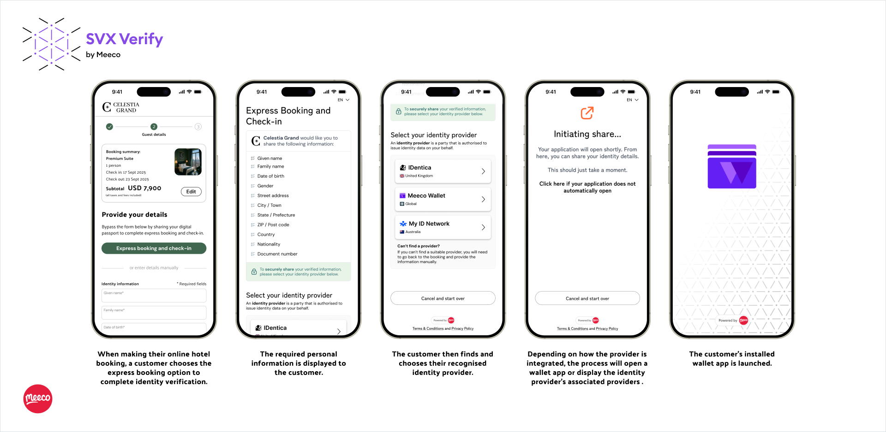
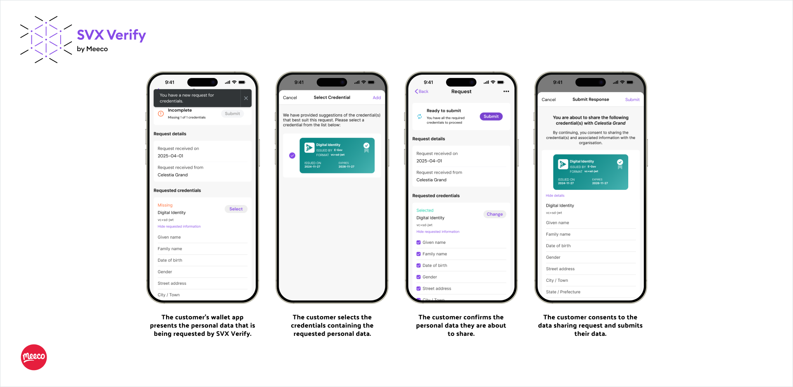
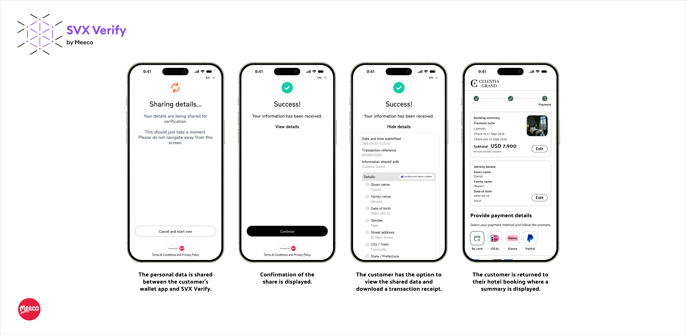
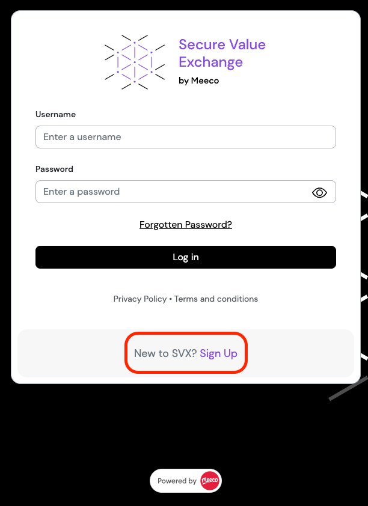
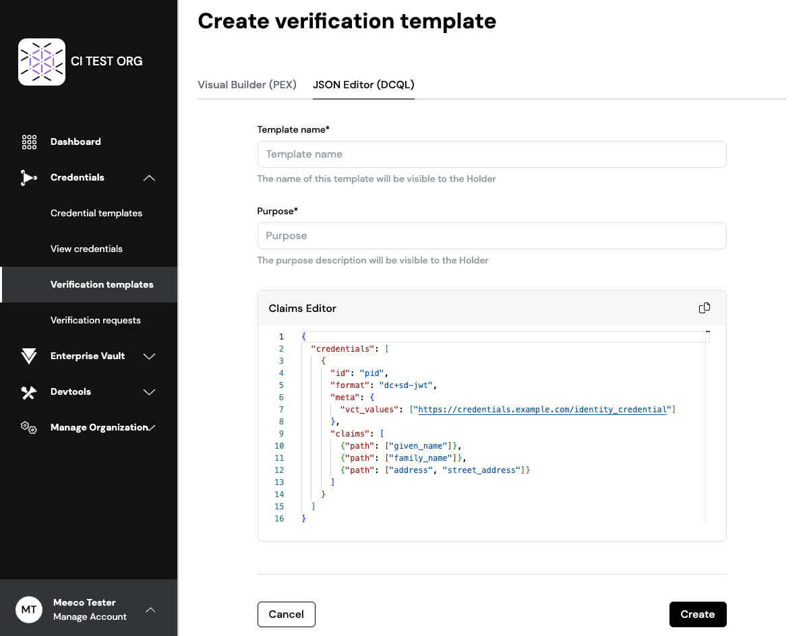
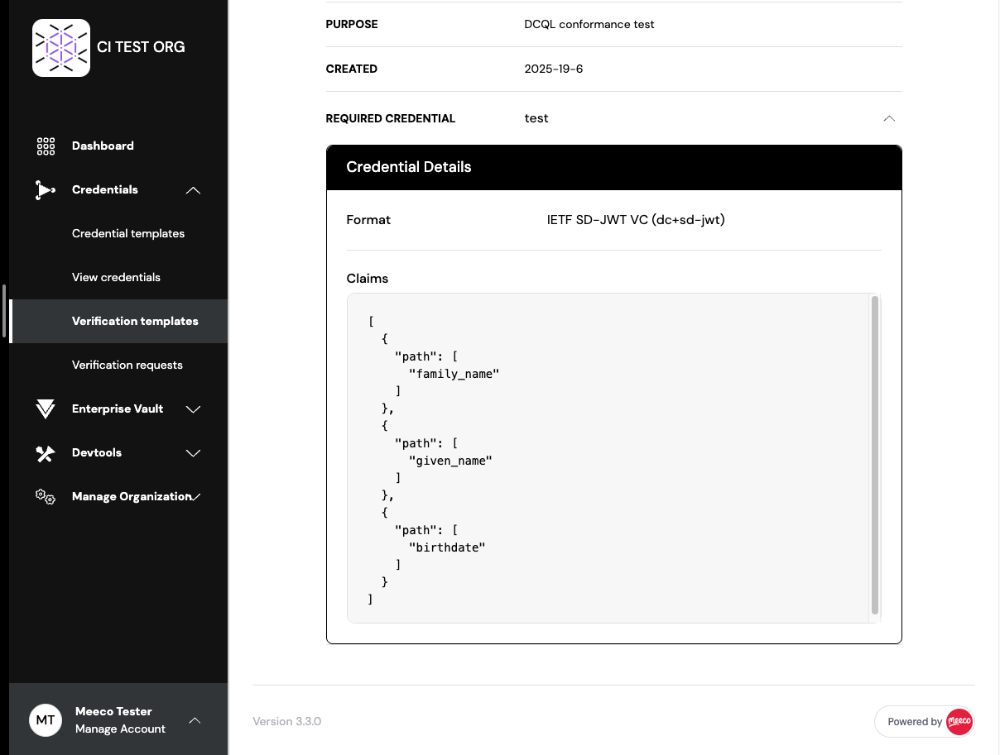
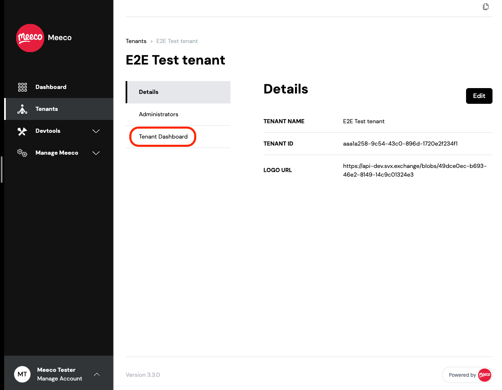
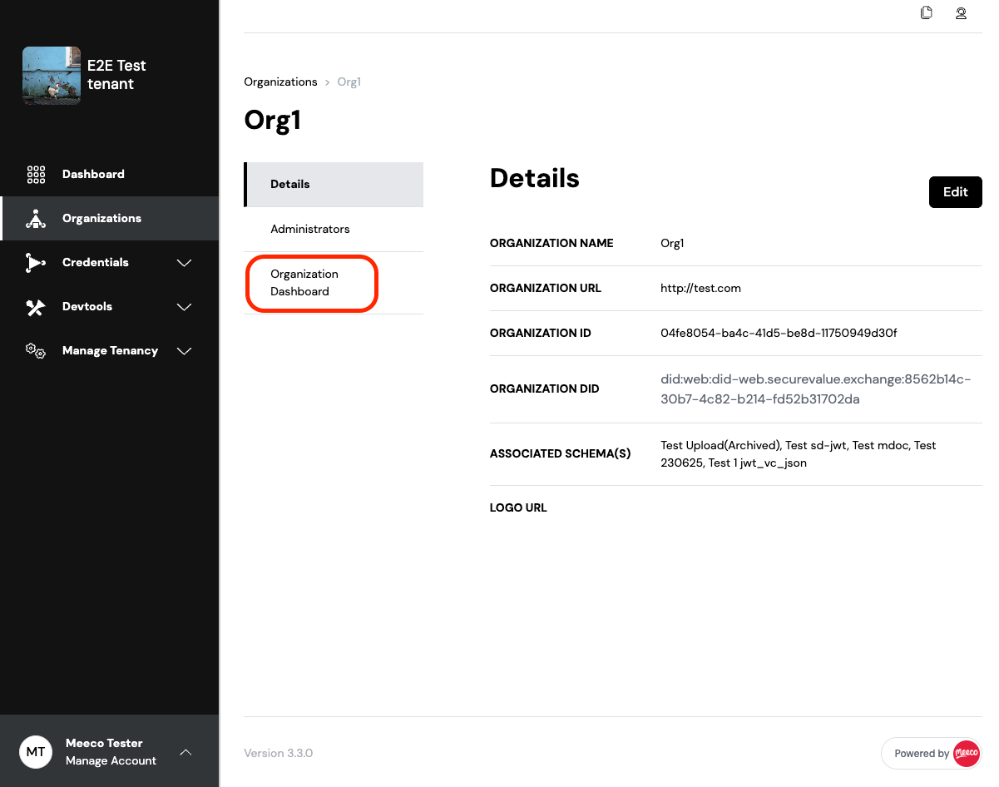
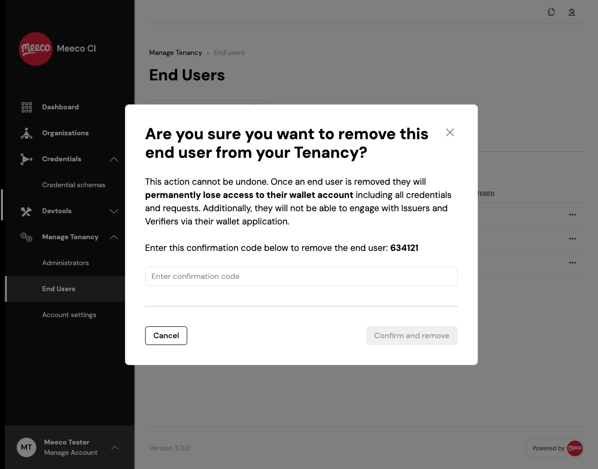

# SVX 3.0.0 Release Notes

**Software Release Date:** XX September 2025

**Summary:** 

SVX 3.0.0 is a major release that introduces **SVX Verify**, expands standards support, and delivers operational improvements across the platform. With this release, we continue our commitment to providing a future-proof foundation for high-assurance digital identity and credential exchange.

- **SVX Verify**: Launch of a new hosted service for low-friction, high-assurance identity verification, supporting both wallet-based and account-based models.

- **Self Signup**: New customers can now sign up and access the SVX Sandbox independently, accelerating onboarding and testing.

- **Resource Hook**: The Organisation Wallet can now fetch claims from external resource servers during credential issuance, simplifying integration with existing business systems.

- **OpenID4VCI & OpenID4VP v1.0 Support**: Full support for the final 1.0 versions of these standards, aligning SVX with the broader ecosystem.

- **DCQL Support**: Introduction of the Digital Credentials Query Language, providing a simpler, real-world-focused alternative to DIF’s Presentation Exchange.

- **DPoP Support**: Optional Demonstrating Proof of Possession support added to Organisation and Holder Wallets for stronger token security.

- **Updated IETF SD-JWT VC (draft-08)**: All components updated to support the latest draft, including migration from `vc+sd-jwt` to `dc+sd-jwt`.

- **Unified Configuration Framework**: All components now use JSON-based configuration backed by JSON Schema, ensuring consistency, validation, and easier operations.

This release also includes multiple usability enhancements, bug fixes, and security updates across the Portal, SVX API, Organisation Wallet, and Holder Wallet.

Here are the highlights of the new features introduced in SVX 3.0.0:

# New Features
## SVX Verify
Identity verification is a critical step in digital journeys that require organisations to know the users' identity. Traditional approaches rely on document scanning and can be slow, costly and error prone. They introduce friction for users and complexity for organisations, all while creating new risks around oversharing of PII and compliance issues that come along with that.

SVX Verify offers a new way forward. Instead of relying on document scans, it leverages high-assurance digital identity solutions to deliver:

- **Streamlined identity verification**: A user flow causing fewer drop-offs, higher conversions and overall reduced friction.

- **Go Live in Minutes**: Use our hosted user experience to start verifying credentials with minimal setup or integration effort.

- **Future proof**: Support for standards-based digital credentials as they roll out.

### How it works
SVX verify makes it simple for organisations to integrate high-assurance identity verification into their workflows:

1. **Define** the identity attributes you’re looking to verify

2. **Redirect to SVX Verify**: From any integrated system, users are redirected to the hosted SVX Verify flow

3. **Identity verification**: Users verify their identity either by

    - Wallet-based credentials: Presenting digital credentials such as ISO Mobile Documents and IETF SD-JWT VCs  directly from a wallet.

    - Account-based providers: Authorising a trusted identity provider to share verified attributes using OpenID Connect

4. **Consent and security built-in**: SVX Verify managed consent, data sharing and error handling, ensuring privacy and compliance.

5. **Retrieve verified data**: Verified attributes are retrieved via an API or made available in Portal.

Below is a journey that shows how SVX Verify can be used in hotels to enable online check-in using a wallet-based system:

<p align="center">



</p>

### Bridging today and tomorrow
SVX Verify is designed to fully embrace the new generation of secure, privacy-preserving digital credentials. As governments worldwide adopt standards such as ISO Mobile Documents and IETF SD-JWT VCs, SVX Verify provides organisations with a pathway to accept these high-assurance credentials as they roll out.

At the same time, adoption will vary by country and ecosystem. Many markets already offer digital identity services through APIs and regulated identity providers. SVX Verify includes a bridge component that connects to these account-based ecosystems, allowing organisations to accept trusted identities today while creating derived credentials for use across their own networks.

### Built on Organisation Wallet
SVX Verify is built on the SVX Organisation Wallet. It provides a hosted UI for end-users and an API-first model for organisations, ensuring rapid deployment without complex setup. By bridging today’s account-based identity providers with tomorrow’s wallet-based credentials, SVX Verify gives organisations a future-proof way to verify identity with high assurance, low friction, and full compliance.

## Self Signup to SVX
Previously, new users had to contact Meeco directly to access the SVX Sandbox environment. We have now introduced a self signup form, allowing users to register themselves and begin testing SVX functionalities more quickly and easily.

This feature can be enabled/disabled on a per installation basis.

<p align="center">

</p>

## Issuance via Resource Hook
The **Resource Hook** is a new feature in the SVX Organisation Wallet that enables credential issuance using data from an external resource server.

When a credential issuance request is received, the Organisation Wallet automatically calls the configured resource server to fetch the required data. The returned values are then included as claims in the issued credential.

This approach separates responsibilities:

- **Organisation Wallet** manages the technical aspects of issuance flows and ensures compliance with open standards (e.g. OpenID4VCI).
- **External resource server** handles the business logic and provides the data that is included as claims in the credential.

This allows organisations to integrate the Organisation Wallet seamlessly into their existing systems without duplicating or moving business logic into the wallet itself.

The Resource Hook functionality can be configured directly in the Organisation Wallet.

For more details on configuration options, refer to [Appendix B](#appendix-b---resource-hook).

# Standards Updates
## OpenID4VCI and OpenID4VP v1.0 Support
After numerous years of being under development, both OpenID specifications have recently published a final version (1.0). We’re extremely proud to announce that the SVX Platform fully support Issuers, Verifiers and Wallet Providers in using these protocols in conjunction with ISO Mobile Documents, IETF SD-JWT VC and W3C Verifiable Credentials.

Below are some notable new features that are supported:

### Support for DCQL
DCQL is defined in section 6 of the [OpenID for Verifiable Presentations v1.0](https://openid.net/specs/openid-4-verifiable-presentations-1_0.html#name-digital-credentials-query-l) specification:

> The Digital Credentials Query Language (DCQL, pronounced [ˈdakl̩]) is a JSON-encoded query language that allows the Verifier to request Presentations that match the query. 

DCQL simplifies the complexity of Presentation Exchange (PEX) by focusing on real-world use cases, offering a simpler design, practical features, and a specification tailored to the OpenID4VP protocol. For more information about DCQL, refer to [OpenID for Verifiable Presentations 1.0](https://openid.net/specs/openid-4-verifiable-presentations-1_0.html#name-digital-credentials-query-l). Refer to [Appendix A](#appendix-a---dcql-query-examples) for examples of DCQL Query.

Note that DIF Presentation Exchange (PEX) implementation remains unchanged and can still be used.

### Support for DPoP
As recommended in the OpenID4VCI specification, under [Best Current Practice for OAuth 2.0 Security](https://openid.net/specs/openid-4-verifiable-credential-issuance-1_0.html#name-best-current-practice-for-o), support for DPoP has been added to both the Organisation Wallet and the Holder Wallet. 
DPoP support is optional and can be enabled via component configuration.

Demonstrating Proof of Possession (DPoP) allows securing an access token by binding a cryptographic key into it. Usage of the access token is only allowed when a valid proof JWT is sent alongside in the request header. For more information about DPoP, refer to [RFC 9449: OAuth 2.0 Demonstrating Proof of Possession (DPoP)](https://datatracker.ietf.org/doc/html/rfc9449).

This complements really well the OAuth 2.0 Proof Key for Code Exchange (PKCE), which secures the exchange of the authorization code received in the authorization code flow. Both are mandatory in the [FAPI 2 Security Profile](https://openid.net/specs/fapi-security-profile-2_0.html), often considered an industry standard when it comes to security.

### Transition to Final
The publication of the final 1.0 specifications is a major milestone and a clear signal to the digital credential ecosystem. While future iterations will emerge, Meeco is committed to treating this release as a **long-term supported (LTS) baseline**, ensuring stability and backwards compatibility for our customers.

During the draft process we introduced parameters such as `protocol_version` to handle multiple draft versions (e.g. OpenID4VP draft 10 and draft 18). However, maintaining compatibility with drafts creates unnecessary fragmentation. Each draft differs slightly, and no other ecosystem players are continuing to support them.

To promote alignment and reduce integration complexity, this release **drops all support for draft versions and only accepts the final identifiers**:

- `openid4vci-v1`
- `openid4vp-v1`

These values are also applied by default when the parameter is not specified.

By consolidating on the final 1.0 specifications, we simplify integration, remove ambiguity, and ensure that our customers are fully aligned with the broader ecosystem moving forward.

## Updated IETF SD-JWT VC to draft 08
As part as our commitment to follow and support most used credential formats in production use cases, we’ve updated all components to support draft 08 of the [IETF SD-JWT-based Verifiable Credentials](https://datatracker.ietf.org/doc/draft-ietf-oauth-sd-jwt-vc/08/) specification.

The most notable change introduced in this draft is a new credential format identifier:

- **From** `vc+sd-jwt` 
- **To** `dc+sd-jwt` 

# Operating Updates
## Unified (JSON-based) Configuration Framework
To make day-to-day operations easier, we’ve standardised how configuration for components is defined, validated and documented across the SVX Platform.

Previously, components used different formats (YAML, dotenv, etc.). All SVX components now use a single configuration format (JSON) with consistent file names and key structures across the platform.  Common settings, such as database connections, are configured in the same way, no matter the programming language and framework used.

Every config is backed by a JSON Schema, which is validated automatically at container startup. This ensures that outdated or invalid configs fail fast, making misconfigurations easy (or at least easier) to detect and fix.

The JSON Schema also serves as living documentation, providing descriptions for every config key.

# Component Updates
## Portal
### DCQL Support
Portal has been updated to support DCQL query creation and processing.

- Added support for creation of a `Verification Template` with DCQL Query. `Create Verification Template` page has now been separated into two tabs, Visual Builder (PEX) and JSON Editor (DCQL)


- Added support to view DCQL Query verification responses
- Added support for viewing `Verification Templates` with DCQL Query format

### New functionalities
- Added detailed view of `constraints` `format` and `signature algorithm` for `View Presentation Template` page.


- Added support for credentials using `dc+sd-jwt` format identifier.
- Added a link from the `Tenant/Organization Details` page to the corresponding Dashboard.



- Added ability to Create and View the `Credential Type` `type` for W3C VC formats

### Enhancements
- Added `audience`, `IDP Login URL`, `Tenant ID` and `Organization ID` (if available) to applications. This makes it easier to configure system-to-system authentication using OAuth 2’s client credentials flow.

- Added confirmation code check when removing an end user from a tenant.


- Allowed Global Admins to view archived tenant details from the Tenants list.
- Updated the `jwt_vc_json` verification template example for presentation exchange (PEX) to align with OpenID4VP v1.0.
- `Organization Url` is no longer a required field when creating or editing an Organization, added regex validation.
- Changed `Disclosure Frame` editor from a plain text area, to a JSON code editor component for `Credential Templates` creation and editing.
- Changed `Disclosure Frame` to be editable for `Credential Templates`.

### Removed
- Removed support for creating credentials types and presentation templates using `vc+sd-jwt` format identifier. Replaced with `dc+sd-jwt` to align with OpenID4VI V1.0
- Removed the ability to add end-users to a tenant from the portal.
- Removed the `Pending End Users` tab from the End Users page, along with all related pages and functionalities.

### Bug Fixes
- Fixed parsing of non-array `vp_tokens` to show older verification_results correctly.
- Fixed an issue where the copied icon was not displaying correctly for copied values. 
- Removed duplicated ID field for global admin details in the View Administrator page.
- Removed the Edit button for archived schemas to prevent unintended modifications.
- Trimmed search input to remove unnecessary whitespace for `Tenants`, `Organisations`, `Credential Schemas`, `Credential Templates`, `Verification Templates`, and `Verification Responses`.
- Fixed missing "No results found for '{search string}'" message when searching archived Credential Templates, Verification Templates, and Verification Requests with no matches.
- Fixed missing "No archived Credential Templates / Verification Templates / Verification Requests found" message when no archived items are available for these sections.
- Fixed error handling for creating credential schema - the page no longer hangs when the schema name is too long and an appropriate error message is shown.
- Updated the following error messages to be more user-friendly: `field_too_long`, `invalid_company_url`, `agent_with_this_name_already_exists`.
- Fixed validation to correctly detect syntax errors in uploaded JSON files on the `Create Schema` page.
- Fixed an issue where error messages persisted during tenant creation and when adding an administrator.
- Fixed the Add button on the `Add Administrator` page to only become clickable after input fields are valid.
- Fixed the Create button in the `Create Credential Template` and `Create Verification Template` page to only become clickable after input fields are valid.
- Fixed areas that were missing Japanese translations.
- Fixed `Format` on `Credential Types` tables displayed the format for mdoc as its doctype
- Fixed `valid at issuance` so that the `valid_at` value is set to null for credential types, ensuring the credential is valid at the time of issuance.
- Fixed credential type preview `Valid From` to calculate based on the current timestamp instead of the credential type’s creation date.
- Fixed a bug that didn't accept the edited version of the `Disclosure Frame` when creating a `Credential Templates`.
- Fixed an issue where the docType `org.iso.18013.5.1.mDL` was automatically converted to `Mobile Driving License (mDL ISO/IEC 18013-5:2021)`. All credentials using Mobile Document show as (ISO Mobile Document).
- Fixed the portal login page title to reflect the correct title. It is also configurable in IDP with the config setting `branding` -> `app_title`.

## SVX API
### OpenID4VP v1.0 Support
- Added new parameters to `POST /presentation_definitions` to add support for DCQL Query  
  - `type` - `'pex' | 'dcql'`
- Added new properties to `POST /presentation_request` response  
  - `parameters.dcql_query`  
  - `parameters.presentation_definition_type`
- Added new `model_version` value `dcql-openid4vp-v1` to `PresentationDefinition`
- Added `type` query parameter to `GET /presentation_definitions` endpoint

### Self-Signup
- New Endpoints
  - `GET /signup` - Display public signup registration form
  - `POST /signup` - Submit signup registration with reCAPTCHA validation
  - `GET /signup/success` - Show signup confirmation page
  - `GET /signup/resend-verification` - Display resend verification email form
  - `POST /signup/resend-verification` - Resend verification email with reCAPTCHA validation
  - `GET /signup/resend-verification/success` - Show resend verification confirmation page
- Features
  - Email verification workflow with token-based validation
  - reCAPTCHA protection on all form submissions
  - Feature toggle support via `signup.enabled` config variable
  - Integration with existing notification system for verification emails
  - Automatic user and tenant creation upon successful email verification
  - Company name uniqueness validation to prevent duplicate tenant names
- Configuration Properties
  - `enabled` - Whether user signup is enabled
  - `verification_token_expiry_seconds` - Signup verification token expiry time in seconds
  - `resend_verification_cooldown_seconds` - Signup cooldown period for resending verification emails
  - `confirmation_email_recipient` - Email address to receive signup confirmations
  - Added an endpoint `POST /tenant/with_admin/{user_id}` that allows creating a new tenant where the first admin is not the current user but the user specified by the `user_id` parameter.
  - Enhanced invitation creation with email normalization (case-insensitive).

### New Functionalities
- Added a public endpoint `GET /orgs/{org_id}/logo` that redirects a client to the logo of the organisation.

### Enhancements
- Latest **SD-JWT-VC draft-08** related changes.
  - Updated the credential type format identifier from `vc+sd-jwt` to `dc+sd-jwt` for SD-JWT credential types.
  - The credential header `typ` for SD-JWT is now set to `dc+sd-jwt` for new credential generation. Verification continues to support both `sd-jwt-vc` and `dc+sd-jwt` format identifiers to ensure backward compatibility.
- `POST /openid/presentations/requests` payload parameter `scope` no longer defaults to `openid`. If nothing provided, it will be `null`.
- Updated password minimum length requirement to 12 characters.

### Removed
- Removed support for OpenID4VP draft-18:  
- `openid4vp-draft18` presentation requests created in the past are still returned by the API, but there is no way to create new ones. Use `protocol_version = openid4vp-v1`.
- Removed `client_id_scheme` payload parameter from `POST /openid/presentations/requests`.

### Bug Fixes
- Fixed storing events in development when `users.login_id` (username) is not a UUID.
- Fixed storing `ItemDeleted` events correctly.

### Security Updates
- Upgraded Node to `22.14 LTS`
- Upgraded Ruby to `3.4.5`
- Upgraded Erlang to `27.3.4.2`
- Updated Elixir to `1.18.4`

## Organisation Wallet
### SVX Verify
- Added SVX Verify with the following pages:
  - `/identity/verification/:id` SessionStep = Index    
    Verifier landing page
  - `/identity/verification/:id` SessionStep = Share  
    Displays the QR code for wallet based flows or a *Sharing Credentials...* screen for account based flows
  - `/identity/verification/:id` SessionStep = Complete  
    Displays the results of the verification process, success
  - `/identity/verification/:id` SessionStep = Error  
    Displays the results of any errors that occur, with the following information: `error_code`, `error_description` and `error_tips`.

- Endpoints:
  - Added verify layout to apply to all `/identity/verification/` routes
  - `GET /identity/verification/:id/status` checks and returns status of the identity verification flow session
  - `GET /identity/verification/:id/request` returns identity verification presentation request token
  - `POST /identity/verification/:id/idp/:idp` updates session with selected IDP
  - `POST /identity/verification/:id/abort` aborts the session, returning to `returnURL`
  - `POST /identity/sessions` for session management, accepts `return_url`, `success_url` and `presentation_template_id`
  - `GET /identity/sessions/:id` for integrators to fetch the session state and `verified_claims`
  - `POST /identity/language` for language switching, accepts `ko`, `jp`, `en` and `zh-hk`
  - `GET /identity/information` endpoint to render `client_uri` for Select ID integration

- Configuration changes:
  - Added `svx_verify.enabled` to config to enable/disable all `/identity/` routes
  - Added `svx_verify.brand_name` to configure the brand name throughout the platform
  - Added `svx_verify.operating_company_name` to configure the name of the company operating the platform throughout SVX Verify
  - Added `svx_verify.presentation_template_ids` to configure available Presentation Template for identity verification flow
  - Added `svx_verify.response_mode` to control the response mode for IDP verification
  - Added `svx_verify.session_expiry` for identity verification session expiry time
  - Added `svx_verify.active_idps` to control the available IDPs
  - Added `svx_verify.bridge_authorize_url` for bridge authorize entrypoint
  - Added `svx_verify.bridge_client_id` for bridge authorization code flow
  - Added `svx_verify.presentation_request_multiple_loads_enabled` to control if the request can be loaded multiple times or only once
  - Added `svx_verify.manual_terms_acceptance_enabled` to control if the deployment asks the user to check the "Accept" box
  - Added `svx_verify.verifier_information` containing various information about the organisation

### OpenID4VCI v1.0 Support
- Configuration changes:
  - Added new configuration value for `protocols.issuance` - `openid4vci-v1`
  - Added new configuration parameter `credential_issuer.max_batch_credential_issuance_size`
  - Added new configuration `credential_issuer.oidc_clients` to register clients for the Issuer IDP
  - Added optional `credential_issuer.include_x5c` configuration attribute
- Renamed `POST /credentials` to `POST /credential` as per OpenID4VCI spec
- Added `background_image` to display credential metadata
- Changed credential metadata returned from `/.well-known/openid-credential-issuer` to match OpenID4VCI v1.0
- `mso_mdoc` credential are returned as base64url encoded string of `issuerSigned` object

### DPoP Support
- `POST /token` and `POST /credential` endpoints
- `credential_issuer.dpop_enabled` configuration added

### OpenID4VP v1.0 Support
- New `openid4vp-v1` value to `protocols.presentation` values list
- New `response_mode` options: `dc_api` and `dc_api.jwt`
- `client_id` prefixes: `redirect_uri`, `decentralized_identifier` and `x509_san_dns`
- Support for `expected_origins` parameter in `POST /presentations/requests` payload
- Presentation request contains `client_metadata` with `vp_formats_supported` listed
- Presentation request `client_metadata.authorization_encrypted_response_alg` replaced by `alg` value from JWKS
- Presentation request `client_metadata.authorization_encrypted_response_enc` renamed to `encrypted_response_enc_values_supported` (array)
- Changed presentation request `scope` attribute value. It no longer defaults to `openid`. It will be included into the token only if explicitly provided.
- Changed response in `POST /openid/presentations/requests/:requestId/submissions` from `submissionId` to `submission_id`
- Configuration changes:
  - Added optional `presentation.request.include_x5c` configuration attribute
  - Added required `presentation.request.default_response_mode` configuration attribute

### Bridging Entity
- Added new configuration `credential_claims_map`, an array of claims mapping from external sources
- Added claim display options `essential_claims`, `optional_claims`
- Added new optional configuration groups under `integrations`
- Added generic `POST /interaction/:uid/select_authorization_server` endpoint to handle form submissions from connections
- Added generic `select_authorization_server` to handle all bridge connection based interaction and its respective `render` function

### Resource Hook
- Feature to fetch claim from a resource server
- Added new configuration group `resource_hook`:
  - `resource_hook.endpoint`: URL of resource server
  - `resource_hook.send_schema_json`: Boolean to include schema JSON of credential in resource hook call (for debugging)

### IETF SD-JWT VC (draft-08) Support
- Updated the credential type format identifier from `vc+sd-jwt` to `dc+sd-jwt` for SD-JWT credential types
- The credential header `typ` for SD-JWT is now set to `dc+sd-jwt` for new credential generation

### New Functionalities
- Added language selection that can be controlled via `?ui_locales=en` query parameter and `ui_locales` cookie:
  - Added English, Japanese, Chinese (HK) and Korean translations
- Added new parameter `verifierRedirectUri` to `POST /presentations/requests`
- Added `redirect_uri` in return body to `POST /openid/presentations/requests/:requestId/submissions` if presentation request was created with `verifierRedirectUri`
- Added new option configuration variable `presentation.request.default_expected_origins`
- Added DCQL support (based on OpenID4VP v1):
  - Create presentation request with `dcql_query`
  - Verify presentation response for presentation request with `dcql_query`
- Added `VerifierError` to catch and render any unexpected errors for front-end related routes
- Added PostgreSQL database support and configuration `postgres` to the codebase
- Added persistent identity verification session data model

### Enhancements
- Application configuration changes:
  - Moved `c_nonce_expires_in` from the root level to `credential_issuer.c_nonce_expires_in`
  - Moved `oid4vc.redis_state_manager_key_expiration_time` to `state_manager.default_expiry`
  - Removed `oid4vc` configuration key
  - Renamed `svx.organization.auth_uri` to `svx.organisation.token_uri` to match the purpose of the configuration value
- Test UI changes:
  - Updated string-type field rendering: rendered as textarea by default, or as date input when format is set to `"date"`
  - Added `dark:text-white` class to field labels and set a fixed white background behind the QR code
  - Updated boolean type to render as radio buttons instead of a checkbox
  - Allowed integer values to be passed as-is instead of converting them to strings
- Additional checks done if configured key contains `x5c` attribute:
  - `O` certificate attribute must be provided
  - `C` certificate attribute must be provided
  - `CN` certificate attribute must be provided and match `app.base_url` host name
  - `subjectAltName` certificate attribute must be provided and match `DNS:app.<base_url host name>` format
- Additional checks for duplicate `vct` or `doctype` values for credential types within the organisation:
  - If a credential type has a duplicated `vct` or `doctype`, it will be removed from the `supportedCredentialTypes`. Errors will be logged at startup when duplicates are detected
  - `GET system/svx/reload_data` returns a 400 error if the organisation has duplicated credential types
- Endpoint changes:
  - Response of `POST /presentations/request` keys transformed to snake case to match the rest of the API
  - Response of `POST /presentations/requests/:id/stats` keys transformed to snake case
  - Changed `/interaction/:uid` endpoint to render an error page instead of raw JSON
- Changed `getCredentialDisplayMetadata` to use the credential type name instead of the schema name
- Added support for `contentEncoding` and `contentMediaType` attributes in JSON schema when claims are automatically generated:
  - Supported encodings: `base64`
  - Supported media types: `image/png`, `image/jpeg`, `image/svg+xml`

### Removed
- Removed support for OpenID4VCI-draft13
- Removed `openid4vci-draft13` configuration value from `protocols.issuance`
- Removed presentation request JWT claims `sub`, `client_name` since they are not standard
- Removed `submission_id` attribute from `POST /openid/presentations/requests/{requestId}/submissions` endpoint response
- Removed `supported_credential.<ID>.expiry` configuration (replaced by `expires_at`, `expires_in`)
- Removed support for OpenID4VP draft-18
- Removed `credential_issuer.supported_credential` configuration properties replaced by SVX API:
  - `vct`
  - `expires_at`
  - `expires_in`
  - `valid_at`
  - `valid_ion`
  - `disclosure_frame`
- Removed `sd_jwt_vc.reserved_claim_keys` configuration (claims list from `@meeco/sd-jwt-vc` library is used as default)

### Bug Fixes
- Added validation for `POST /openid/presentations/requests/:requestId/submissions` to check whether `vp_token` is an empty array represented as `'[]'`
- Fixed application crash when `credential_types` selection was blank on `/test/issue` form:  
  - Added backend validation for missing `credential_types` and claims  
  - Enforced required selection in the frontend
- Fixed `x5chain` in `COSE_Sign1` for issued `mso_mdoc`:  
  - Single certificate is included as a byte array string instead of an array of single byte array string
- Fixed error handling on bad JSON payload: now returns HTTP 400 instead of HTTP 500
- Fixed security declaration of public endpoints in `api-spec.yaml`

### Security Updates
- Upgraded `oidc-provider` to version `8.8.1`

## Holder Wallet
### Bridging Entity
- Added `bridge_wallet` object to config, includes:
  - `enabled`: Turns on the bridge wallet setup
  - `external_reference`: string representing the external reference for wallet initialisation
  - `wallet_key_type`: defines the `kty` and `crv`
  - `issuer_wallets`: contains information related to IDPs used for the Bridge issuance flow
- Added `/authorize` endpoint to initialise the bridge_wallet flow

### New Functionalities
- DPoP support - detect `dpop_signing_alg_values_supported` from `/.well-known/openid-configuration`
- Added `SetupService` provider to `AppModule` for post initialization setup
- Supports PEX and DCQL Presentation Request
- Added `/authorize/receive/callback` endpoint for bridge_wallet initiated flows to return to
- Added the credential format type `dc+sd-jwt` for SD-JWT credential types
- Added OpenID4VP DCQL support:
  - Register Presentation Request with `dcql_query`
  - Submit Response from a presentation request with `dcql_query`
- Added OpenID4VP v1.0 support:
  - `POST /wallets/:id/send` protocol_version added with `openid4vp-v1`
  - Added validation for `x509_san_dns` Verifier Client Identifier Scheme to ensure the identifier is a URL and matches the `dNSName` SAN entry of the x.509 leaf certificate
- Added OpenID4VCI draft16 support:
  - New default and only issuance `protocol_version` value is `openid4vci-v1`
- Added optional `key.client_assertion_jwk` to enable `private_key_jwt` client auth where needed

### Enhancements
- This upgrade includes the latest SD-JWT-VC draft-08 related changes:
  - Focused on mandatory SD-JWT VC draft-08 JOSE Header `typ` changes (`dc+sd-jwt`), deferring optional type metadata (type as URL) implementation to a future epic
- Legacy `vc+sd-jwt` format is now marked as deprecated. All new issuance and presentation requests should use the new `dc+sd-jwt` format
- Existing `vc+sd-jwt` credentials will continue to work in storage and for verification and presentation
- Changed `GET /wallets/{:id}/receive/{:state}` response attributes:
  - `proof` has been replaced with `proofs` and `proofs.jwt` is always an array
  - `mso_mdoc` issuance - expects a base64url encoded `IssuerSigned` as per OpenID4VCI v1.0 spec (changed from previous implementation expecting a `DeviceResponse`)

### Removed
- Removed `GET /wallets/{:id}/receive/{:state}` response attributes:
  - `c_nonce`
  - `c_nonce_expires_in`
- Removed `POST /wallets/{:id}/receive/get_access_token` response attributes:
  - `c_nonce`
  - `c_nonce_expires_in`
- Removed `POST /wallets/{:id}/receive/get_credential` response attributes:
  - `c_nonce`
  - `c_nonce_expires_in`
- Removed `openid4vp-draft18` support
- `client_id_scheme` is no longer used separately from the `client_id`
- `client_metadata_uri` parameter is no longer supported
- Removed `pre_registered_client_id_scheme_default_metadata` configuration attribute since it is no longer used anywhere

### Bug Fixes
- Fix incorrect SVX host config variable reference used in DID Service Factory
- Fixed issue with creating an `mso_mdoc` device response in mixed-format presentation definitions (e.g., those including `jwt_vc_json` or `dc+sd-jwt`), where it incorrectly attempted to match `mso_mdoc` VCs against input descriptors for other formats
- Fixed security declaration of public endpoints in OpenAPI spec

# Deprecations and EOL
- The use of the credential format identifier `vc+sd-jwt` is deprecated
- Removed `openid4vp-draft18` protocol version support for OID4VP protocol; `openid4vp-v1` should be used instead
- Removed `openid4vci-draft13` protocol version support for OID4VCI protocol; `openid4vci-v1` should be used instead

# Appendix
## Appendix A - DCQL Query Examples
### `jwt_vc_json`
> When used in the context of W3C Verifiable Credentials, the claims_path parameter always matches on the root of Verifiable Credential (not the Verifiable Presentation).

Example `jwt_vc_json` credential
````
{
  "iss": "https://example.gov/issuers/565049",
  "nbf": 1262304000,
  "jti": "http://example.gov/credentials/3732",
  "sub": "did:example:ebfeb1f712ebc6f1c276e12ec21",
  "vc": {
    "@context": [
      "https://www.w3.org/2018/credentials/v1",
      "https://www.w3.org/2018/credentials/examples/v1"
    ],
    "type": [
      "VerifiableCredential",
      "IDCredential"
    ],
    "credentialSubject": {
      "given_name": "Max",
      "family_name": "Mustermann",
      "birthdate": "1998-01-11",
      "address": {
        "street_address": "Sandanger 25",
        "locality": "Musterstadt",
        "postal_code": "123456",
        "country": "DE"
      }
    }
  }
}
````

#### Simple query
````
{
  "credentials": [
    {
      "id": "example_jwt_vc",
      "format": "jwt_vc_json",
      "meta": {
        "type_values": [["IDCredential"]]
      },
      "claims": [
        {"path": ["credentialSubject", "family_name"]},
        {"path": ["credentialSubject", "given_name"]}
      ]
    }
  ]
}
````

### `dc+sd-jwt`
#### Simple query
````
{
  "credentials": [
    {
      "id": "pid",
      "format": "dc+sd-jwt",
      "meta": {
        "vct_values": ["https://credentials.example.com/identity_credential"]
      },
      "claims": [
        {"path": ["given_name"]},
        {"path": ["family_name"]},
        {"path": ["address", "street_address"]}
      ]
    }
  ]
}
````

### `mso_mdoc`
#### Simple query
````
{
  "credentials": [
    {
      "id": "my_credential",
      "format": "mso_mdoc",
      "meta": {
        "doctype_value": "org.iso.7367.1.mVRC"
      },
      "claims": [
        {"path": ["org.iso.7367.1", "vehicle_holder"]},
        {"path": ["org.iso.18013.5.1", "first_name"]}
      ]
    }
  ]
}
````

## Appendix B - Resource Hook
Resource Hook is a feature to call an external resource server when a credential is requested via OpenID4VCI protocol.

Non-normative example of resource hook configuration:

````
"resource_hook": {
  "endpoint": "http://resource-server.com/get-claims",
  "send_json_schema": false
}
````
A http request to the configured `resource_hook.endpoint` will be sent with the following payload
````
"user_id": "some_user_id", // user_id in access_token
"format": "dc+sd-jwt", // format identifier of requested credential
"timestamp": "1757421906693", // number of milliseconds since Unix epoch (1970/01/01)
"vct": "vct", // dc+sd-jwt specific credential identifier
"doctype": "doctype", // mso_mdoc specific credential identifier
"type": ["credential-type"], // jwt_vc_json specific credential identifier
"schema": { /** Credential Schema associated with the Credential Template **/ }
````
The format specific credential identifier(s) will only have value when it is the corresponding format identifier.

For example, if a request for a sd-jwt vc is received by the SVX Organisation Wallet, the following will be sent to the resource server.
````
{
  "user_id": "some_user_id",
  "format": "dc+sd-jwt",
  "timestamp": "2025-09-09T05:40:29Z",
  "vct": "studentID"
}
````
`schema` is only sent if `resource_hook.send_json_schema` is set to `true`.
It is meant to help with testing and development.
It is expected that the resource server would be able to identify the required claims based on the format specific credential identifier.
Sending the `schema` for each request is additional payload that should be not necessary.

For security considerations, `X-SVX-OCW-Signature` will be sent along in the HTTP header.
It is a signature of the JSON string of the payload, signed with the same key that signs credentials. (SVX Organisation DID or the key of the configured `credential_issuer.signing_kid`)
This can be used to verify that the call is from the expected SVX organisation wallet component.

The expected response is of the following format:
````
// object containing claims
"claims": {
  "foo": "bar",
}, 
````