# SVX 3.1.1 Release Notes

**Software Release Date:** 26 November 2025

**Summary:**
Summary:
This release delivers four major feature areas across the SVX platform, Organisation Wallet and Portal. The key outcomes are improved autonomy for organisations, faster template creation and management, more flexible credential workflows, and a significantly enhanced developer testing experience.

# New Features
## Self-Service Organisation Wallet Deployment
This release introduces self-service deployment of Organisation Wallets, giving administrators greater autonomy when testing and running proof-of-concept flows for issuing and presenting credentials. Organisations can now deploy their own wallets directly from the SVX portal with minimal support from Meeco.
### Key capabilities
- Deploy an Organisation Wallet directly from the application view within an organisation.
- Deployment status is shown in the UI and marked as Online once ready.
- Delete an existing deployment if it is no longer required or if a new deployment is needed.
- Only one active Organisation Wallet deployment is allowed per organisation.
### How it works
1. Create a new application within your organisation.
2. Open the application details page.
3. Click the **“Deploy Organisation Wallet”** button.
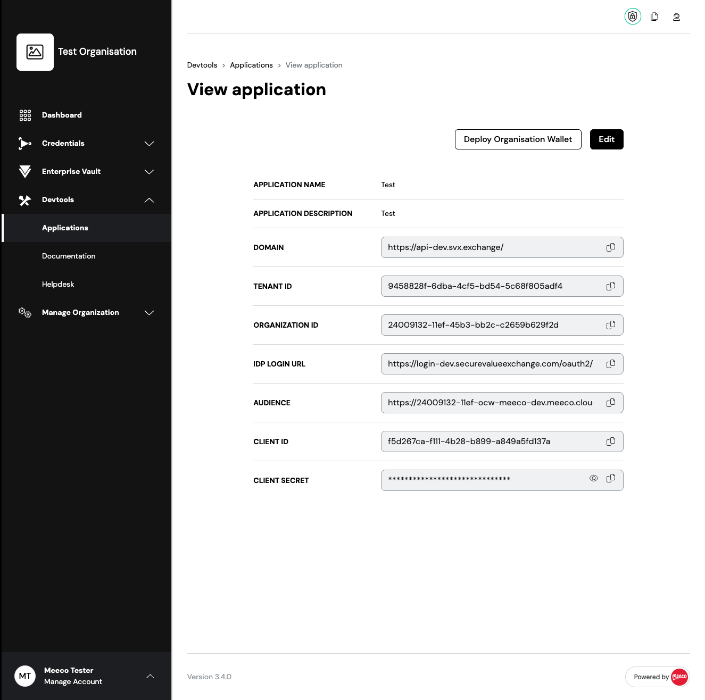

4. Wait for the deployment to complete. The deployment is ready when the status shows **Online**.
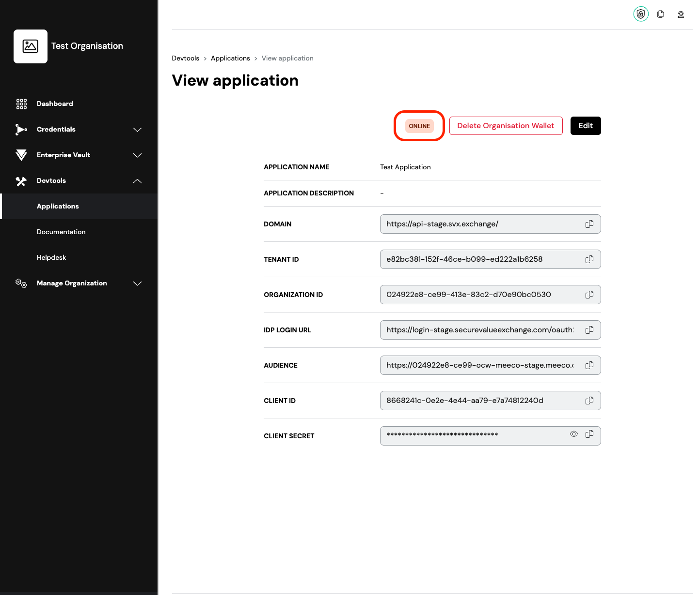

5. Use the **Audience** URL displayed in the application to access and run your Organisation Wallet.
6. Once you set up credential/verification templates, you can use Organisation Wallet test UI to test out issuance and verification.
    * Test issuance: `${your-organisation-wallet-url}/test/issue`
    * Test verification: `${your-organisation-wallet-url}/test/verify`

## Verification Template Enhancement
This enhancement delivers major improvements to the creation, management, and usability of Verification Templates.
### Key capabilities
#### Improved visibility & usability
- By clicking a template, or selecting “View”, the details appear on the right-hand side instead of opening a new page.
- Redesigned structure makes information easier to locate and understand.
- Provides an overview and detailed JSON of the requested credential for the verification template.
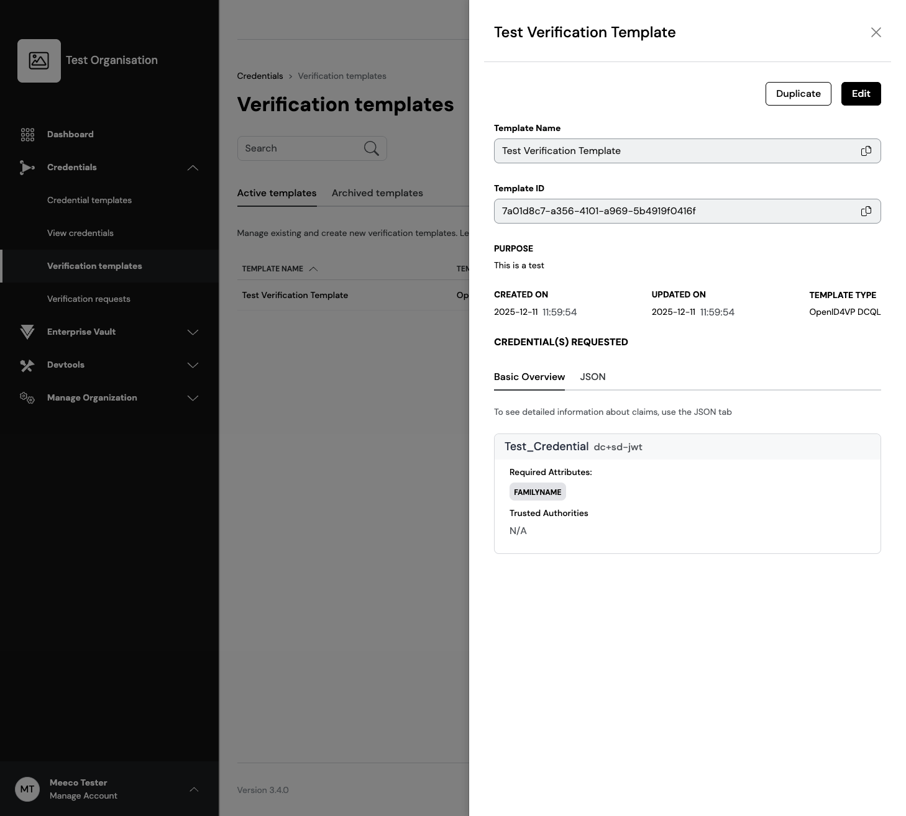
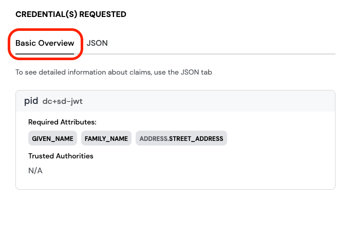
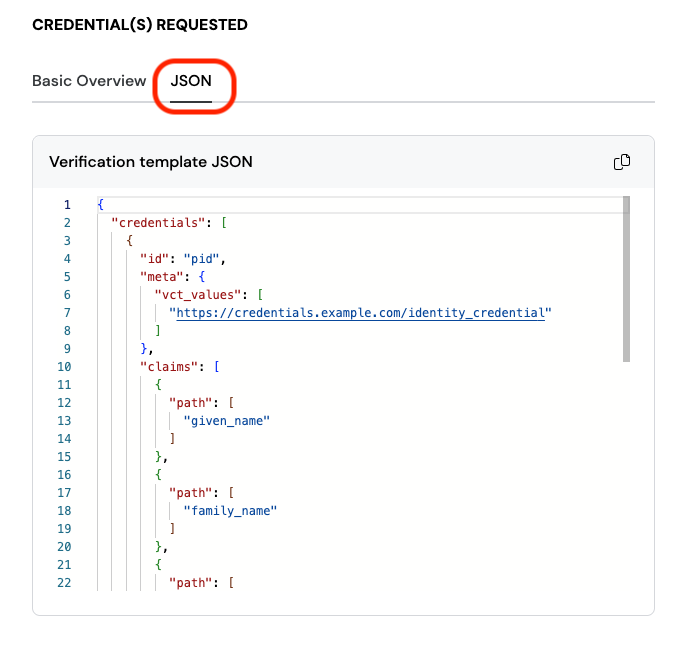

#### Faster template creation
- Create templates directly from credential template available within the organisation—ideal for rapid testing and PoC scenarios.
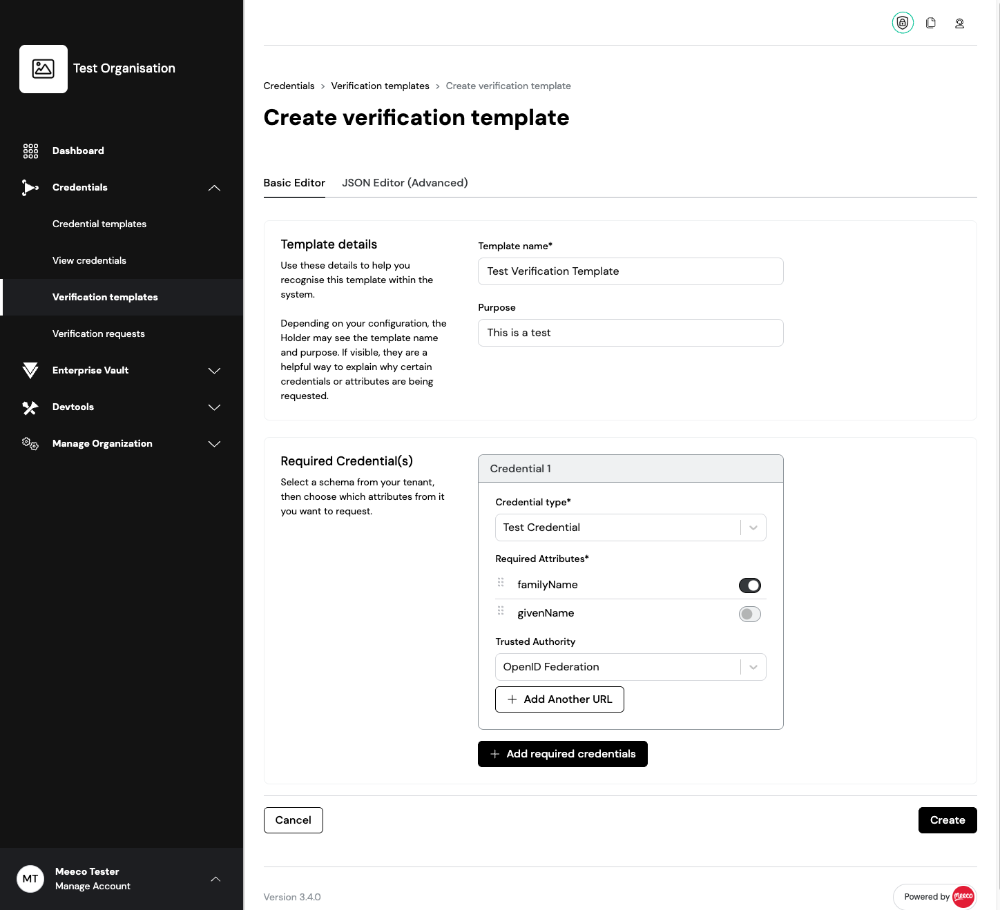

- Build templates using an improved JSON editor with better usability and built-in base templates.
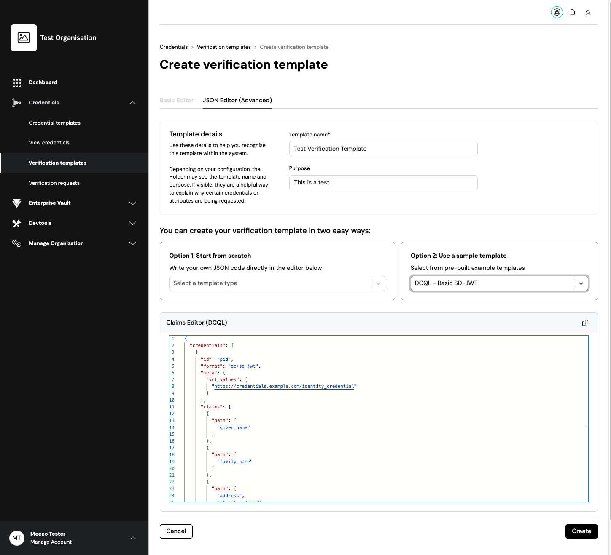

#### Full template management
- Edit verification templates directly from the portal.
- Duplicate existing templates to quickly create new variations.
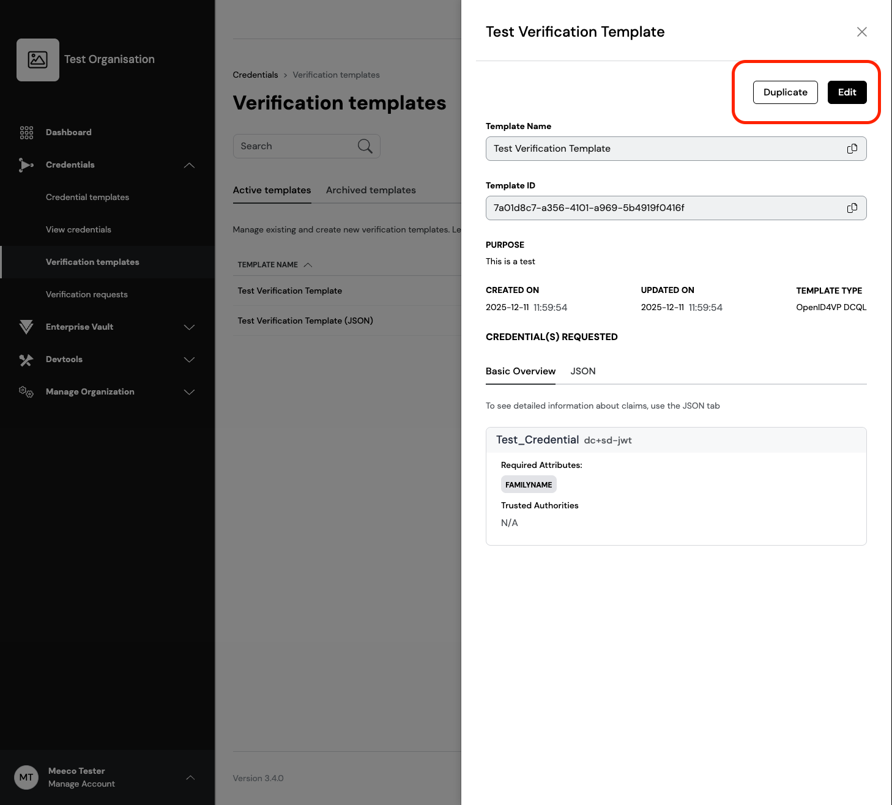
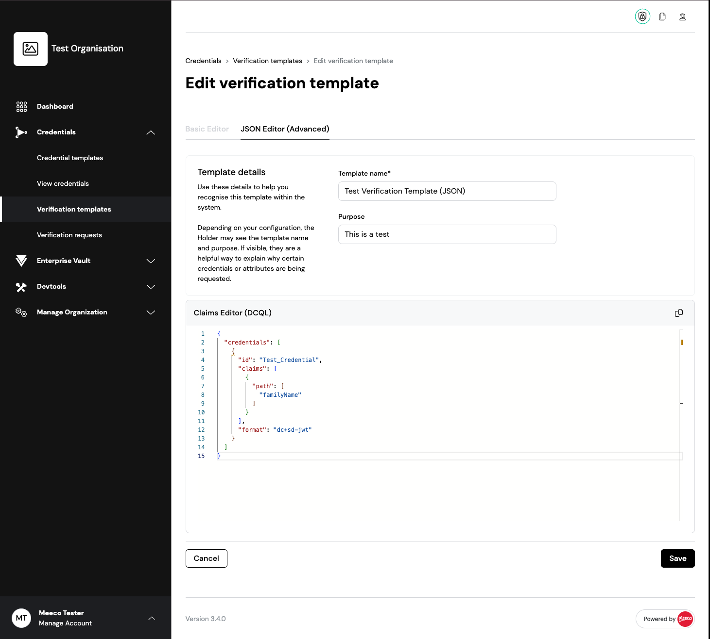

#### Better search & filtering
- Filter Presentation Definitions by updated-at-from and updated-at-to for improved navigation and auditing.
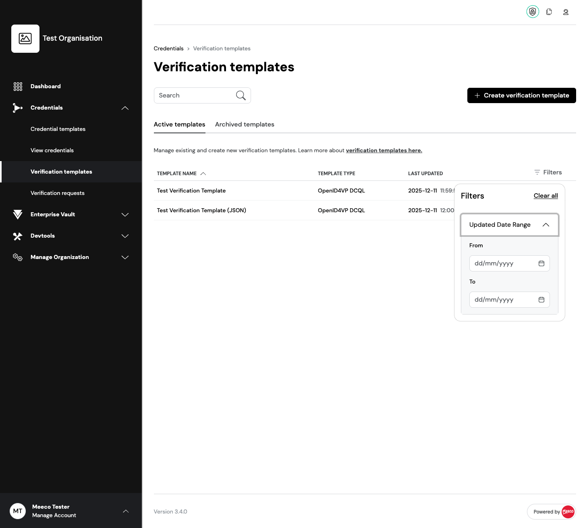

## Ad-hoc Credential Issuance and Verification
This release adds two new endpoints to the Organisation Wallet, enabling organisations to issue and verify credentials directly, without requiring full OpenID4VCI or OpenID4VP flows.
### Key capabilities
#### Ad-hoc credential issuance
- Issue signed credentials programmatically using a new protected POST /credentials endpoint.
- Ideal for automation, backend integrations, and streamlined testing workflows.
- Reuses existing credential configurations, schemas, and issuer signing keys.
#### Direct credential verification
- Verify arbitrary credentials using the new POST /credentials/verify endpoint.
- Supports multiple credential formats and leverages SVX’s verification logic.
- Provides structured results including passed checks, warnings, and errors.

These enhancements offer flexibility, easier integration, and improved support for enterprise credential workflows.

## Updated Test Issuance and Presentation UI
The Test Issuance and Presentation pages have been redesigned to provide a clearer, more modern, and developer-friendly experience. While no functional changes were made, the UI updates significantly improve visibility and testing efficiency.
### Key improvements
- Modernised interface showing more relevant and useful test information.
- Updated UI supports both **light** and **dark** mode for improved usability.
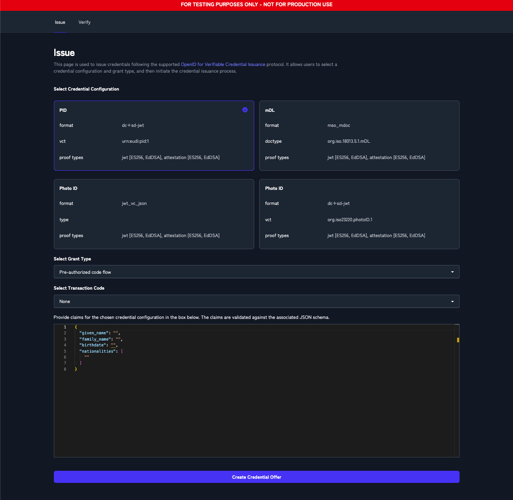
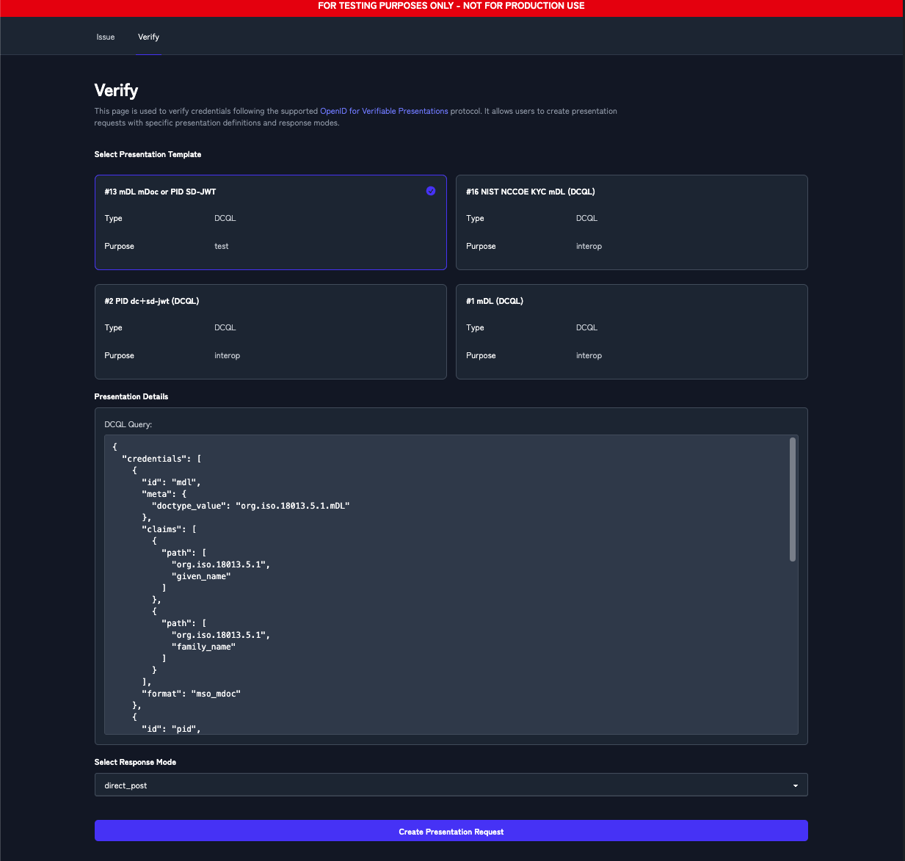

# Component Updates
## Portal
### SSelf-Service Organisation Wallet Deployment
New Features:
- Added "Deploy Organisation Wallet" button to `View Application` page, protected by `vc:org:manage` security rights, allowing administrators to initialise a new organisation wallet instance for their application. Button triggers organisation passphrase verification before deployment creation and is only visible when no deployment exists for the application.
- Added "Delete Organisation Wallet" button to `View Application` page, conditionally displayed only when an active deployment exists and the deployment's `app_client_id` matches the current application's client ID, ensuring users can only delete deployments they own. Deletion requires passphrase verification for security.
- Added deployment online/offline status badge displaying "Online"/"Offline" based on the `online_at` timestamp field, shown when a deployment exists for the current application.
- Added informational message "Organisation already has active deployment" displayed when a deployment exists for a different application, preventing conflicting deployments.
- Added `organisationWalletDeployment` feature flag to Config.ts interface and configuration files, enabling/disabling all deployment functionality including API calls and UI controls.

### Verification Template Enhancement
New Features:
- Added new `Verification Template` view side panel.
- Added PEX detection for JSON submissions when creating a `Verification Template`
- Created new sample templates for use in `Verification Template` creation
- Added Getting `Started Section` with `Presentation Definition` sample selection and JSON upload
- Added `Edit` and `Duplicate` functionalities for `Presentation Definition`. When duplicating or editing a verification template, the template can only be edited using the JSON editor.
- Added auto-save and auto-load of draft `Presentation Definitions`.
- Added Trusted Authorities to `Presentation Definitions` builder tool.
- Added base filter component.
- Added filter to `Presentation Definitions` table view, can filter on `updated-at-from` and `updated-at-to`
- Added a page that allows the user to edit `Presentation Definitions`

Enhancements:
- Improved error messages in toast notifications when saving or creating a Presentation Definition fails.
- Changed the `PEX` builder into a `DCQL` builder.
- Changed `Verification Template` table columns. (Definition Name / Created On) -> (Updated On / Tempalte Name / Template Type).
- Changed date display for `Verification template` to include HH:MM:SS as well.
- Change `Presentation Definition` to now disable builder tab if `JSON builder` isnt compatible.
- Changed navigation on `Presentation Definition` create/edit to navigate to the newly created/edited template.
- Changed `Presentation Definition` purpose to optional.

Removed:
- Removed old `Verification Template` view single page designs.
- Removed `PEX` builder tool.
- Removed helper text for `Template Name` and `Purpose` when creating a `presentation definition`, replaced with more details in `Template Details`.

### Security Updates
- Changed `@meeco/sdk` version to `8.6.0-beta`.

## SVX API
### Self-Service Organisation Wallet Deployment
New Endpoints:
- Added new endpoint `GET /deployments/ow` to get a list of deployed organisation wallets.
- Added new endpoint `GET /deployments/ow/{id}` to get a specific deployed organisation wallets by `id`.
- Added new endpoint `POST /deployments/ow` to create an organisation wallet deployment.
- Added new endpoint `DELETE /deployments/ow/{id}` to delete an organisation wallet deployment by `id`.

New Features:
- Added a new security right `svx:org:deploy_ow` to enable self-service organisation wallet deployment.
- Added support for automated deployment authorization: `GET /automated-deployments/authorize?admin_id=XYZ&org_od=XYZ&agent_id=XYZ`
- Added `organizations` scope and organisation admin access information to ID tokens, when `organizations` scope is used.

### Verification Template Enhancement
- Added `parameters.presentation_template_name` to the response of `GET /openid/presentations/requests`
- Updated `GET /openid/presentations/requests` query parameters: 
    - added date filtering (created_at_from, created_at_to, updated_at_from, updated_at_to) and improved parameter ordering
- Updated query parameter types for `GET /openid/presentations/requests`: 
    - changed 'page' and 'per_page' from number to integer

### Enhancements
- Added support for examples and $comment as top-level attributes in credential schemas
- Added optional PostgreSQL TLS support (`postgres.tls`, p`ostgres.cacertfile`). TLS is disabled by default (when omitted). When enabled, TypeORM will use the specified CA certificate for secure connections with server verification.

### Bug Fixes
- Added validation for empty objects in `handleRedisFind`, so it now returns `undefined` when the key is not found in Redis. Now the system returns 400 error correctly in the case the key is not found in the Redis and an empty object is returned.

### Removed
- Legacy organisations and services have been removed

### Security updates
- Upgraded `Phoenix` to version 1.8
- Upgraded `Elixir` to version 1.19.3
- Upgraded `Ruby` to version 3.4.7
- Upgraded `Rails` to version 8.0.3
- Upgraded `OTP` to version 27.3.4.6
- Upgraded libraries

## Organisation Wallet
### Ad-hoc Credential Issuance and Verification
New Endpoints:
- Added new protected endpoint `POST /credentials` for Ad-hoc Credential Issuance
- Added new protected endpoint `POST /credentials/verify` for Ad-hoc Credential Verification

Configuration Properties:
- Added required `credential_issuer.supported_client_auth_methods` configuration for better control of `token_endpoint_auth_methods_supported authorization` server metadata
- Issuer metadata `credential_signing_alg_values_supported` attributes uses integers to refer to supported algs.

### Updated Test Issuance and Presentation UI
- Updated the look and feel of the test pages at `/test/issue` and `/test/verify` (previously `/test/present`). No functional changes have been made, rather the pages have been updated to improve testing by showing more (useful) information. The following javascript libraries were added:
    * Monaco editor
    * TailwindPlus Elements (for modal component and mobile menu)
- Updates test pages to support light and dark mode

### SVX Verify
Configuration Properties:
- Added `svx_verify.idp_options` configuration that allows to set custom authorization_request_endpoint per IDP
- Added `presentation_display_mode` configuration to explicitly control identity verification UI on endpoint `POST /identity/verification/:id `via the `presentation_display_mode` cookie.

Enhancements:
- Changed the Samesite to `lax` for the `svx_verify_session` cookie
- Simplified SVX Verify language select to use query parameters

Removed:
- Removed URL check for `success_url` and `return_url` in` POST /identity/sessions` endpoint to allow any URL to be used, such as a custom app URLs.
- Removed `POST /identity/language` endpoint. Use query parameters to change language preference.

Bug Fixes:
- Fixed an issue where the interaction view’s error page failed to render by adding the required footer information to the request.

### Bug Fixes
- Fixed key attestation verification. No longer checks for optional iss claim.

### Security Updates
- Upgraded `oidc-provider` to version 9.5.2
- Patch: `exp` is optional in wallet attestation token.