# SVX 4.0.0 Release Notes

**Software Release Date:** 22 June 2026 (date is indicative)

## Summary

SVX 4.0 is a major architectural release representing the most significant restructuring of the SVX platform since its inception in April 2023. This release consolidates the platform's internal architecture from more than ten microservices into four, reducing operational complexity. The key outcomes are faster development velocity, a smaller attack surface for personally identifiable information (PII), simplified deployments, and a unified wallet service that can serve as issuer, verifier, and wallet provider simultaneously.

- Unified, standalone Wallet Service
- PII never leaves Wallet service; encrypted storage with envelope encryption (AES-256-GCM).
- Cost and reliability: fewer runtimes, no RabbitMQ (DB-driven queues), simpler deployments.

Using the new architecture we've included the following features.

- Wallet KMS Integration
- Wallet Simplified Configuration
- Wallet Admin Login via Passkeys

## Breaking Changes

**Important:** SVX 4.0 introduces breaking changes across the API surface. Please review the relevant sections carefully before upgrading.

- The **Organisation Wallet** (OW) is merged into the new unified **Wallet** service.
- The **Holder Wallet** (HW) is merged into the new unified **Wallet** service.
- Restructuring of OW and HW API endpoints in the new unified **Wallet** service.
- **Vault and Keystore APIs are removed.** Encrypted credential storage and key management are now handled directly within the Wallet service.
- **The VC service API is removed.** Schema management, credential type management, presentation definition management, and credential operations are now available through the Wallet API.
- **The** `authorize` **endpoint for bridge installations is split off and hosted at** `/bridge/authorize`. The callback endpoint `/authorize/receive/callback` becomes `/bridge/authorize/receive/callback`.
- **Credential and verification management has moved out of the Portal.** Credential schemas, credential templates, verification templates, issued credentials, and presentation requests/responses are now managed through the new Wallet Dashboard.
- **ISO Mobile Document credential storage format has changed.** Credentials are now stored as `IssuerSigned` rather than `DeviceResponse`. There is no automatic migration of previously stored credentials.
- **Wallet configuration is no longer exclusively file-based.** Most configuration is now managed at runtime, persisted in the application database, and accessible via the Wallet API or the Wallet Admin UI.

## New Features

### Unified Wallet Service

The most significant change in SVX 4.0 is the introduction of a single, unified Wallet service that combines the roles of issuer, verifier, wallet provider, and credential bridge. Previously these roles were spread across separate deployments with separate configurations. Now a single deployment can serve all roles simultaneously.

This means less infrastructure to manage, fewer points of failure, and a single API surface to integrate with. For customers building on SVX, this dramatically reduces the complexity of getting a working credential issuance and verification flow running.

### PII Containment

In previous versions of SVX, issuing a verifiable credential required PII to pass through multiple services: the Organisation Wallet, the VC API, and the Vault (for storage). Each additional service that touches PII increases the attack surface and complicates compliance.

In SVX 4.0, PII never leaves the Wallet service boundary. Credential data is encrypted at rest within the Wallet. This makes it substantially easier to reason about where sensitive data lives and to demonstrate compliance with data protection requirements.

### Simplified Credential Issuance and Verification APIs

Credential management, schema management, and verification template management are now consolidated into the Wallet API. The new endpoints follow a consistent, role-prefixed structure under

- `/issuer/*`
- `/verifier/*`
- `/wallets/*`
- `/verify/*`
- `/bridge/*`

Endpoints related to the OAuth Authorization Server are not prefixed.

Holder wallet endpoints (`/wallets/*`) are available unchanged from the previous Holder Credential Wallet (HCW).

Below is an overview of the new endpoints:

#### Schemas and templates

```
POST   /issuer/schemas
GET    /issuer/schemas
GET    /issuer/schemas/{id}
PUT    /issuer/schemas/{id}
GET    /issuer/schemas/{id}/schema.json
DELETE /issuer/schemas/{id}

POST   /issuer/templates
GET    /issuer/templates
GET    /issuer/templates/{id}
PUT    /issuer/templates/{id}
DELETE /issuer/templates/{id}

POST   /verifier/templates
GET    /verifier/templates
GET    /verifier/templates/{id}
PATCH  /verifier/templates/{id}
DELETE /verifier/templates/{id}
```

Schemas and templates no longer use archiving, deleting them removes it from the database. Each entity can be updated directly. There is no versioning of schemas anymore.

#### Credential offers
```
POST   /issuer/offers
GET    /issuer/offers/{id}
DELETE /issuer/offers/{id}
```

#### Issued credentials
```
POST   /issuer/credentials
GET    /issuer/credentials
GET    /issuer/credentials/{id}
DELETE /issuer/credentials/{id}
PATCH  /issuer/credentials/{id}/status
```

#### Credential status lists
```
GET /issuer/status_list/{id}
```

#### Presentation requests
```
POST   /verifier/requests
GET    /verifier/requests
GET    /verifier/requests/{id}
DELETE /verifier/requests/{id}
GET    /verifier/requests/{id}/responses
GET    /verifier/requests/{id}/responses/{id}
DELETE /verifier/requests/{id}/responses/{id}
```

### SVX Verify

The `identity` prefix has been renamed to `verify` across all SVX Verify endpoints.
```
POST /verify/sessions
GET  /verify/sessions
GET  /verify/sessions/{id}
GET  /verify/verification/{id}/request
GET  /verify/verification/{id}/status
POST /verify/verification/{id}/accept_terms
```

`GET /verify/sessions` is a new endpoint to facilitate session listing.

### Bridge

What used to be a combination of two components configured in a very specific way has now merged into one. The bridge module handles account based flows using OpenID Connect and creates derived credentials which can be consumed by verifiers using OID4VP. 

```
GET /bridge/authorize
GET /bridge/authorize/receive/callback
```

Bridge functionality can be used via SVX Verify with selected integrations.

### OpenID4VCI
```
POST /issuer/credential
POST /issuer/nonce
```

### OAuth Authorization Server
Authorization server to support access token creation for credential issuance.
```
GET  /authorize
POST /par
POST /token
POST /challenge
GET  /jwks
```

### OpenID4VP
```
GET  /verifier/requests/{id}/jwt
POST /verifier/requests/{id}/responses
```

### Well-Known Endpoint
Various well-known endpoints for standard support remain unchanged.
```
GET /.well-known/oauth-authorization-server
GET /.well-known/openid-configuration
GET /.well-known/openid-credential-issuer
GET /.well-known/jwt-vc-issuer
GET /.well-known/appspecific/selectid.rp
```

### Wallet Issuer/Verifier Identifier

The Wallet supports the following issuer identifier types: URL, DID, and X.509. Supported DID methods are `did:key` (including the EBSI variant) and `did:jwk`.

### Wallet x509 Certificate Management
New endpoints manage x509 certificates. Certificates pair with signing keys and, once linked, include in the token's `x5c` header. A separate certificate type, called `trust_anchor`, exists. Configuring Wallet to verify credential and presentation request trust chains uses these certificates to ensure trust among parties.
```
GET    /system/certificates
POST   /system/certificates/import
DELETE /system/certificates/{certificate_id}
POST   /system/certificates/csrs
```

### Application API Key
New endpoints enable application-level access to the Wallet API. Each record contains a client_id and client_secret pair, exchangeable for a token valid until expiration.
```
POST   /application/applications
GET    /application/applications
DELETE /application/applications/{id}
POST   /application/token
```

### Admin Login via Passkeys Endpoint
The Wallet API enables internal admin management. It provides endpoints for admin account management and login. Passkeys authenticate admins.

Alternatively, an external IDP can be used. In both cases, the gateway must be configured to accept tokens from the chosen source.
```
GET    /admin/accounts
DELETE /admin/accounts/{id}
POST   /admin/invitations
GET    /admin/invitations
DELETE /admin/invitations/{id}
POST   /admin/invitations/accept/options
POST   /admin/invitations/accept
POST   /admin/session/options
POST   /admin/session
POST   /admin/session/refresh
```

### Image assets upload
The Wallet now provides built-in storage for image assets such as credential logos and credential background. Images are uploaded once via the API (or from the Wallet Dashboard when editing display settings and credential templates) and stored in the Wallet database. The returned asset URL can then be referenced anywhere a logo or image URI is accepted.

Supported formats are PNG, JPEG, and WebP. Uploads require admin authentication and are validated before being persisted: a configurable maximum file size (2 MiB by default), verification that the file content matches its declared image type, and an optional ClamAV virus scan (enabled by default). Retrieval is unauthenticated so that stored images can be served directly to wallets and verifier UIs.
```
POST /assets/images
GET  /assets/images/{id}
```


### Wallet Dashboard

A new browser-based Wallet Dashboard is now served directly by the Wallet service. It replaces the credential and verification management screens previously hosted in the Portal, giving wallet operators a dedicated interface for managing their deployment without needing access to the broader platform Portal.

Functionality available in the Wallet Dashboard:

**Credential Schemas**

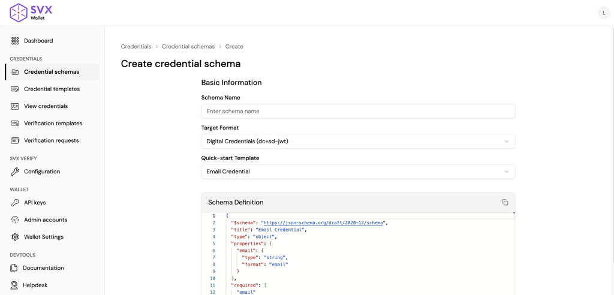

**Credential Templates**

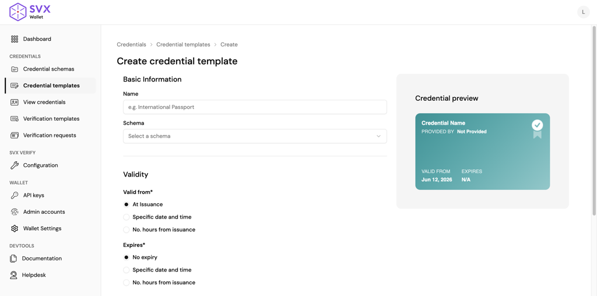

**Verification Templates**

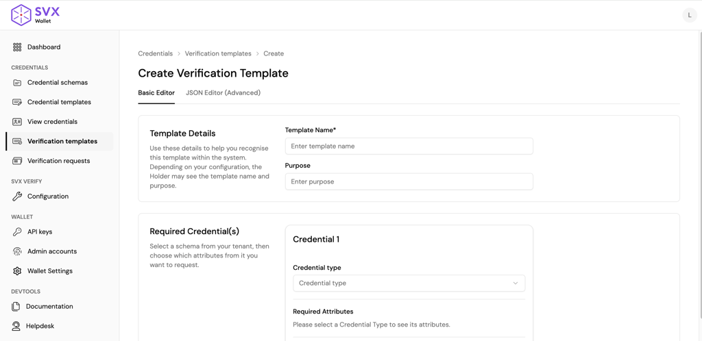

**Issued Credentials**

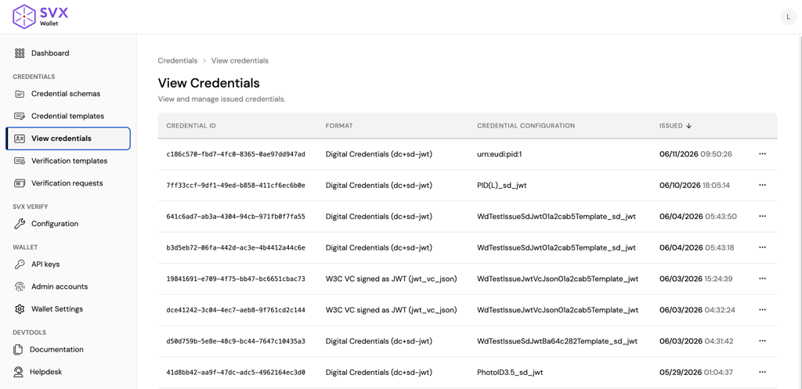

**Presentation Requests and Submissions**

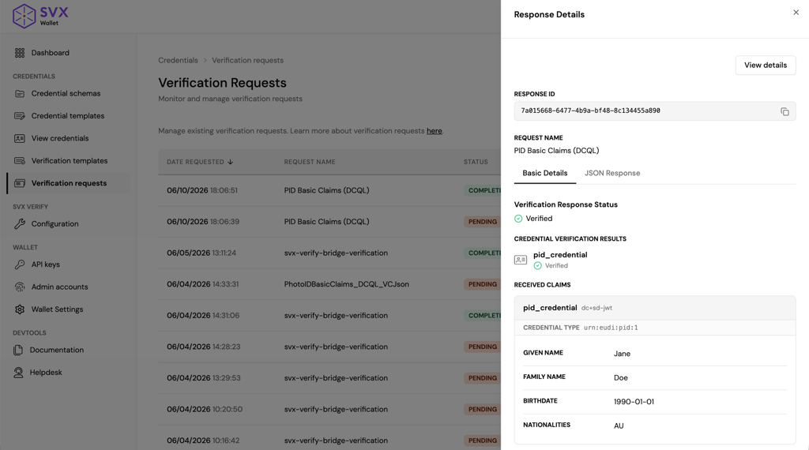

**Verify sessions and reporting**

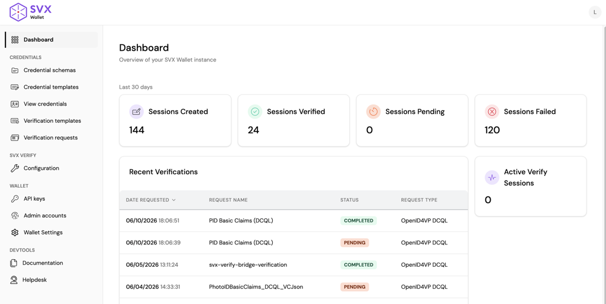

**SVX Verify Configuration**

Configure how SVX Verify appears to end users and which identity providers are presented.

<!-- TODO: Add screenshot for SVX Verify Configuration -->

**Manage API Keys**

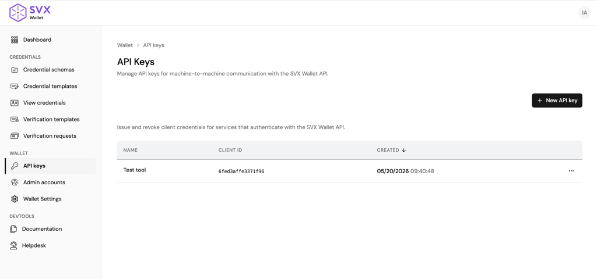

**Admin Accounts**

Invite new administrators and manage existing admin access. Administrators authenticate using passkeys.

<!-- TODO: Add screenshot for Admin Accounts -->

**Wallet configuration**

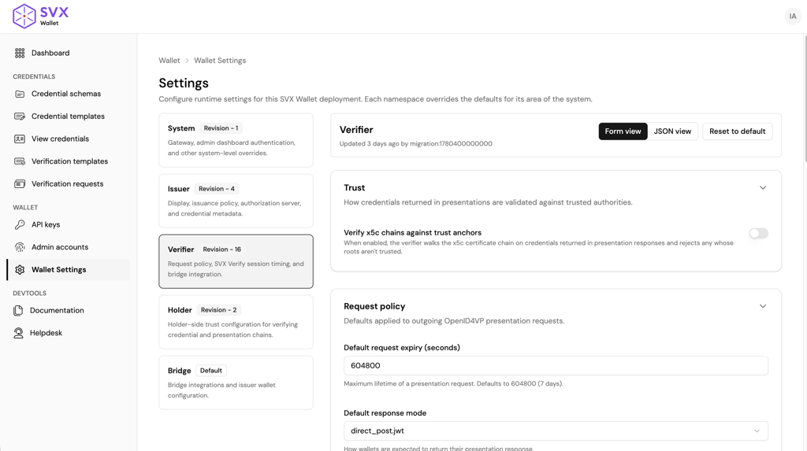

### Wallet KMS Integration

Cryptographic Keys are a core part for any credential platform. They are used, amongst others, for signing access tokens, encrypting presentation responses, binding credential to wallets and securing credentials. Managing these keys as such is critical. In this version we’ve put in place a completely revised key management solution that provides more freedom how and where keys are managed.

Cryptographic Keys required for base functionalities no longer need to be provided via configuration.
Keys will be automatically generated and stored by the Wallet KMS.

Keys are split out based on their role. The role determines what the key is used for, for example credential signing or database encryption.

#### Key adapters
The currently supported adapters are listed below.
- **Local KMS Adapter:** keys are stored in the attached database service. Private key material is stored encrypted using a Master Encryption Key, an AES key, provided via configuration. Suitable for development and environments without an external KMS.
- **AWS KMS Adapter:** keys are stored in AWS KMS. Cryptographic operations such as signing are done via API calls to AWS KMS.

All cryptographic operations are handled within this Key Manager module, allowing for a more defined boundary and interface. This allows the SVX Wallet to abstract away its use of cryptographic keys and simplify integration with KMS such as AWS KMS.

An internal service (shown in the diagram below as KeyManagerService) handles the orchestration of fetching or calling cryptographic function to the KMS. It does so by connecting to the KMS backend via the adapter using the reference ID stored in the Key Registry.

Key Registry (shown in the diagram below) is a register of keys stored in the database. It stores the reference id and other metadata such as the public key part. Some keys such as the Access Token Key require its public key to be exposed via endpoint such as `/jwks`. Storing it in the database removes the need to constantly fetch it from the KMS backend.

The Adapters role is to then call the appropriate API of the KMS backend and transform the response as required. For example, during database encryption, the Key Manager Service will request a Data Encryption Key (DEK) from the adapter. If AWS KMS Adapter is used. It will then call the AWS KMS API GenerateDataKey to obtain the DEK. In this process, the logic that does the envelope encryption for the encrypted data is not directly aware of how the DEK is obtained.

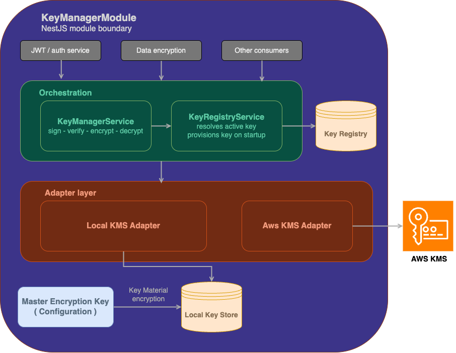

#### Key roles

Each key can be individually configured to use a different adapter. All keys default to the Local adapter. Signing keys support ES256 (default) and EdDSA as alternative algorithms.

| Key | Role | Default Algorithm |
|-----|-------------|-------------------|
| CredentialKey | Signs and verifies access tokens issued during credential issuance via OID4VCI protocol | ES256 |
| AccessTokenKey | Signs issued Verifiable Credentials. Public key is exposed via well known endpoint to allow for verification of the issued credentials. | ES256 |
| PresentationRequestKey | Signs Presentation Request object | ES256 |
| KeyEncryptionKey | Sensitive information and data are stored in the database encrypted using a generated Data Encryption Key (DEK). This Key Encryption Key encrypts the DEK so that it can be stored alongside the ciphertext in the database. Decryption of the encrypted data is also performed using this Key Encryption Key. | AES-256-GCM |
| AdminSigningKey | Signs and verifies access tokens issued for dashboard access. | ES256 |
| HolderClientAssertionKey ¹ | Self Signs a Client Assertion for Holder Wallet Client Authentication. Used when Holder Wallet is configured to use Client Assertion | ES256 |
| HolderClientAttestationKey ¹ | Self Signs a Client Attestation for Holder Wallet Client Authentication. Used when Holder Wallet is configured to use Client Attestation | ES256 |

¹ Optional: generated and used only when the respective feature is enabled.

### Wallet Encrypted Storage

Data is encrypted at rest using **envelope encryption** using Meeco’s [Cryppo](https://github.com/Meeco/cryppo-js) library, using keys managed by the Wallet KMS.

Each record is encrypted with a unique **Data Encryption Key (DEK)** generated at write time. The DEK itself is then encrypted by a **Key Encryption Key (KEK)** managed by a key provider. Only the encrypted DEK is persisted alongside the ciphertext; the plaintext DEK exists only in memory during the operation and is never stored.

The default encryption algorithm for data is **AES-256-GCM**, which provides both confidentiality and authenticated integrity.

#### Key adapters

- **Local KMS Adapter:** the KEK is generated using Cryppo and stored in the database. DEKs are generated using Cryppo and encrypted using the generated KEK. All private key materials are stored encrypted in the database.
- **AWS KMS Adapter:** uses `GenerateDataKey` to atomically create and wrap the DEK in a single KMS API call. The plaintext DEK returned by the API call is not stored.

When using the Local KMS Adapter, key material (KEK and other managed keys) is itself encrypted using a **Master Encryption Key (MEK)** configured under `kms.master_encryption_key` in the static config. If the MEK is not configured, key material is stored unencrypted in the database. Data remains encrypted, but the keys protecting it are not. Configuring the MEK is strongly recommended for anything but local development.

### New Wallet Configuration Approach

Configuring a Wallet deployment previously meant maintaining a large service configuration file covering everything from infrastructure settings to credential display text. SVX 4.0 restructures configuration into two clearly separated layers under a single contract:

- **Static configuration:** a minimal file the deployment owner manages, reduced to what the service genuinely needs before it can start; application host, database and Redis connections, logging, module enablement, and secret material supplied by the operator. Cryptographic keys are no longer part of configuration at all; they are generated and managed by the configured KMS (see Wallet KMS Integration).
- **Runtime settings:** all mutable business and application settings (display metadata, supported credentials, issuance and verification policies, trust configuration) live in the database and are managed via the Wallet API or Dashboard (see Application Runtime Configuration).

Both layers are governed by published JSON Schemas that define every available option, its constraints, and its default value. The static file is validated at startup and runtime documents are validated on every write. Environment variable overrides have been reduced to database credentials only.

The outcome: customer-managed deployment configuration shrinks to a small, stable bootstrap file; day-to-day settings changes need no redeployment; and the effective deployed configuration is always observable with secrets redacted.

#### Application Runtime Configuration

Most Wallet configuration is no longer managed in a static file fixed at deployment time. Mutable application settings are now managed at runtime, persisted in the Wallet database, and organised into five namespaces: system, issuer, verifier, bridge, and holder. Each namespace is a JSON document that can be read and updated through the new `/system/settings` and `/system/settings/{namespace}` endpoints or through the configuration screens in the Wallet Dashboard.

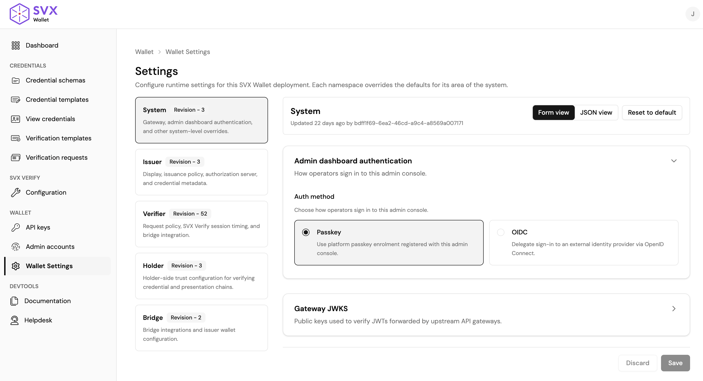
<p align="center">Runtime configuration editor</p>

Every runtime document, similar to static configuration, is validated against a published JSON Schema before it is accepted; invalid updates are rejected with detailed error messages, so it is not possible to persist a configuration the service cannot run with. Defaults are applied centrally from the same schema, and deleting a namespace resets it to defaults.

Updates use optimistic concurrency: each write carries the expected revision number and is rejected with a conflict error if another operator has changed the namespace in the meantime. 

#### Effective Configuration

The effective configuration is the merged result of static deployment config (i.e. config file), runtime settings, and schema defaults. It can be inspected at any time via `GET /system/settings/effective`. This enables administrators to see the current application configuration state at any point, leaving the guesswork out on which configuration is used at any point in time.

Secret values (database and Redis passwords, private key material, client secrets) are redacted in this view, making it safe to use for support and diagnostics.

**Configuration Endpoints**

Below are new endpoints related to configuration.
```
GET    /system/settings
GET    /system/settings/effective
GET    /system/settings/{namespace}
PUT    /system/settings/{namespace}
DELETE /system/settings/{namespace}
```

## Changes and Removals

### SVX API Changes

The following endpoints related to secure storage have been removed.
```
POST   /classification_nodes
GET    /classification_nodes
GET    /classification_nodes/{id}

POST   /connections
GET    /connections
GET    /connections/{id}
DELETE /connections/{id}

POST   /invitations
GET    /invitations
GET    /invitations/{invitation_id}
DELETE /invitations/{invitation_id}
POST   /invitations/{invitation_id}/accept
DELETE /invitations/{invitation_id}/cancel
POST   /invitations/{invitation_id}/confirm
DELETE /invitations/{invitation_id}/reject

POST   /child_users
POST   /delegation_invitations
GET    /delegation_invitations/incoming
GET    /delegation_invitations/outgoing
DELETE /delegation_invitations/{id}
GET    /delegation_invitations/{id}
PUT    /delegation_invitations/{id}/accept
DELETE /delegation_invitations/{id}/reject
DELETE /delegations/{connection_id}
PUT    /delegations/{connection_id}

GET    /activities
GET    /event_feed

GET    /attachments_folders
POST   /attachments_folders
DELETE /attachments_folders/{id}
GET    /attachments_folders/{id}
GET    /blobs/attachment/{id}/{d}
GET    /blobs/public/{id}/{d}
GET    /client_task_queue
PUT    /client_task_queue
POST   /direct/attachments
POST   /direct/attachments/upload_url
DELETE /direct/attachments/{id}
GET    /direct/attachments/{id}
GET    /images/{id}
GET    /item_templates
GET    /items
POST   /items
DELETE /items/{item_id}
GET    /items/{item_id}
PUT    /items/{item_id}
GET    /slots/{id}/attachments_folder

GET    /metrics/attachments
GET    /metrics/connections
GET    /metrics/items

GET    /incoming_shares
GET    /incoming_shares/{id}
PUT    /incoming_shares/{id}/accept
GET    /incoming_shares/{id}/item
POST   /invitations/{invitation_id}/share_intents
POST   /items/{item_id}/encrypt
GET    /items/{item_id}/shares
POST   /items/{item_id}/shares
PUT    /items/{item_id}/shares
GET    /outgoing_shares
GET    /outgoing_shares/{id}
GET    /share_intents
PATCH  /shares
PUT    /shares
DELETE /shares/{id}
```
The following endpoints related to key storage have been removed.
```
POST   /data_encryption_keys
DELETE /data_encryption_keys/{id}
GET    /data_encryption_keys/{id}
GET    /key_encryption_key
POST   /key_encryption_key
POST   /keypairs
GET    /keypairs/external_id/{external_id}
DELETE /keypairs/{id}
GET    /keypairs/{id}
PATCH  /keypairs/{id}
GET    /passphrase_derivation_artefact
POST   /passphrase_derivation_artefact
```

The following endpoints related to verifiable credential management have been moved to (and renamed in) the new Wallet service:
```
POST   /schemas
GET    /schemas
GET    /schemas/{id}
PUT    /schemas/{id}
GET    /schemas/{id}/{version}/schema.json
POST   /schemas/{id}/archive
POST   /schemas/{id}/restore

POST   /credential_types
GET    /credential_types
GET    /credential_types/{id}
POST   /credential_types/{id}/archive
POST   /credential_types/{id}/restore

POST   /presentation_definitions
GET    /presentation_definitions
GET    /presentation_definitions/{id}
GET    /presentation_definitions/{id}/definition.json
PATCH  /presentation_definitions/{id}
POST   /presentation_definitions/{id}/archive
POST   /presentation_definitions/{id}/restore

GET    /credentials
POST   /credentials/generate
POST   /credentials/generate/validate_payload
POST   /credentials/verify
GET    /credentials/{id}

POST   /credentials/status
GET    /status_list/{id}

GET    /.well-known/jwt-issuer
GET    /openid/presentations/requests
POST   /openid/presentations/requests
GET    /openid/presentations/requests/{id}
POST   /openid/presentations/requests/{id}/archive
POST   /openid/presentations/requests/{id}/restore
POST   /openid/presentations/response/verify
POST   /presentations/generate
POST   /presentations/verify
```

The following endpoints related to DID management have been removed. 
```
GET    /did-owner
POST   /did/create
POST   /did/deactivate
POST   /did/update
GET    /did/{identifier}
```

Wallet controls access to it itself. No need for SVX end users entity anymore. The following endpoints have been removed.
```
POST   /user_authorisation/authentication_requests
POST   /user_authorisation/siop_sessions

POST   /end_users/invitations
GET    /end_users/invitations
GET    /end_users/invitations/{id}
DELETE /end_users/invitations/{id}
POST   /end_users/invitations/{token}/accept
POST   /end_users/invitations/short_lived_access_token

GET    /end_users
GET    /end_users/{id}
POST   /end_users/{id}/deletion_queue

GET    /end_user/whoami
POST   /end_user/deletion_queue
```


### **Portal Changes**
The Portal is now scoped to platform and scheme administration. Credential and verification management screens have moved to the new Wallet Dashboard.
**Moved to Wallet Dashboard:**
- Credential Schemas (including all sub-pages)
- Credential Templates (including all sub-pages)
- Verification Templates (including all sub-pages)
- Credentials Issued (including all sub-pages)
- Presentation Requests and Submissions (including all sub-pages)
  
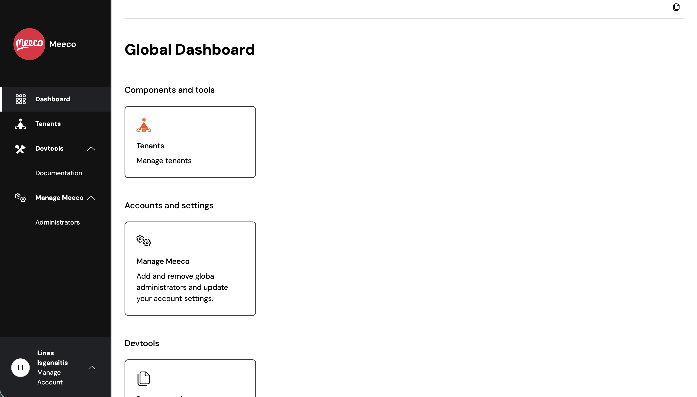

**Removed:**

- Vault Connections
- Tenant Applications
- Organisation Keys and Passphrase management screens
- Tenant End Users

**Kept:**

- All Global Admin screens
- All Tenant Admin screens
- Organisation: Applications and User Management

### ISO Mobile Document Storage

Previously, issued ISO Mobile Document credentials were stored as `DeviceResponse`, this is changed to `IssuerSigned`.

## Migration Notes

### Credential Data

There is no automated migration of credential data from previous services (SVX API, Organisation Wallet, Holder Wallet) to the new Wallet. New deployments should start with a clean state. If migration of existing data is required for your deployment, contact Meeco to discuss your options. This applies to

- Credential schemas
- Credential templates
- Verifier templates (previously presentation templates)
- Credentials issued (issuer)
- Presentation responses received (verifier)
- Credentials received (wallet)

### Wallet Configuration

The previous Organisation and Holder Wallet services used file-based configuration. The new Wallet service uses a different configuration structure with a minimal static config file and runtime settings managed via the API or Dashboard. Existing configuration files are not compatible and cannot be migrated automatically. Operators must rebuild their configuration against the new static config schema and re-apply runtime settings through the Wallet API or Dashboard.

Below is a minimal static configuration file for a deployment with issuer and verifier enabled. Bridge-specific and integration-specific fields are only required when those features are enabled.

```json
{
  "system": {
    "app_host": "https://wallet.example.com",
    "postgres": {
      "host": "localhost",
      "database": "svx_wallet",
      "username": "postgres",
      "password": "change-me"
    },
    "redis": {
      "host": "localhost",
      "database_number": 0,
      "password": "change-me",
      "tls": false
    },
    "logging": {
      "log_level": "info",
      "log_redact_properties": []
    },
    "kms": {
      "master_encryption_key": {
        "keys": [
          { "key_id": "key-1", "key": "<base64-encoded-aes-256-key>" }
        ],
        "active_key_id": "key-1"
      }
    },
    "admin": {
      "enabled": true
    }
  },
  "bridge": {
    "enabled": false
  },
  "issuer": {
    "enabled": true,
    "internal_authorization_server": {
      "supported_client_auth_methods": ["none"],
      "clients": []
    }
  },
  "verifier": {
    "enabled": true,
    "svx_verify": {
      "enabled": true,
      "cookie_secret": "change-me"
    }
  }
}
```

The `kms.master_encryption_key` is strongly recommended for all non-development deployments. Without it, managed key material is stored unencrypted in the database (see [Wallet KMS Integration](#wallet-kms-integration)).

For production deployments, we recommend using the AWS KMS adapter to manage the different signing keys and KEK. Adapters for other KMS platforms can be added easily.

### Existing Wallet Instances

Because of the structural changes to the SVX platform, older Organization and Holder Wallet services **will not be compatible** with the new SVX 4.0 release.
